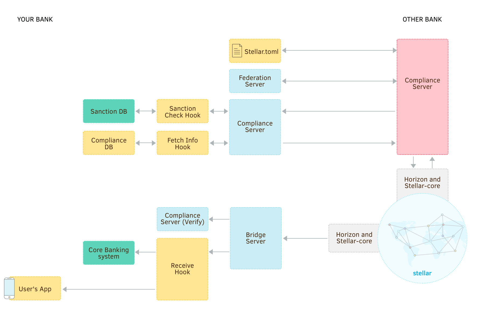

Anchors are entities that people trust to hold their deposits and [issue credits](issuing-assets.md) into the Stellar network for those deposits. All money transactions in the Stellar network (except lumens) occur in the form of credit issued by anchors, so anchors act as a bridge between existing currencies and the Stellar network. Most anchors are organizations like banks, savings institutions, farmers’ co-ops, central banks, and remittance companies.

Before continuing, you should be familiar with:

- [Issuing assets](issuing-assets.md), the most basic activity of an anchor.
- [Federation](concepts/federation.md), which allows a single Stellar account to represent multiple people.
- [Compliance](compliance-protocol.md), if you are subject to any financial regulation.


## Account Structure

As an anchor, you should maintain at least two accounts:

- An **issuing account** used only for issuing and destroying assets.
- A **base account** used to transact with other Stellar accounts. It holds a balance of assets issued by the *issuing account*.

Create them on the test network using the [laboratory](https://stellar.org/laboratory/) or the steps from the [“get started” guide](get-started/create-account.md).

For this guide, we’ll use the following keys:

```js
Issuing Account ID: GAIUIQNMSXTTR4TGZETSQCGBTIF32G2L5P4AML4LFTMTHKM44UHIN6XQ
Issuing Seed:       SBILUHQVXKTLPYXHHBL4IQ7ISJ3AKDTI2ZC56VQ6C2BDMNF463EON65U

Base Account ID:    GAIGZHHWK3REZQPLQX5DNUN4A32CSEONTU6CMDBO7GDWLPSXZDSYA4BU
Base Seed:          SAV75E2NK7Q5JZZLBBBNUPCIAKABN64HNHMDLD62SZWM6EBJ4R7CUNTZ
```


### Customer Accounts

There are two simple ways to account for your customers’ funds:

1. Maintain a Stellar account for each customer. When a customer deposits money with your institution, you should pay an equivalent amount of your custom asset into the customer’s Stellar account from your *base account*. When a customer needs to obtain physical currency from you, deduct the equivalent amount of your custom asset from their Stellar account.

    This approach simplifies bookkeeping by utilizing the Stellar network instead of your own internal systems. It can also allow your customers a little bit more control over how their account works in Stellar.

2. Use [federation](concepts/federation.md) and the [`memo`](concepts/transactions.md#memo) field in transactions to send and receive payments on behalf of your customers. In this approach, transactions intended for your customers are all made using your *base account*. The `memo` field of the transaction is used to identify the actual customer a payment is intended for.

    Using a single account requires you to do additional bookkeeping, but means you have fewer keys to manage and more control over accounts. If you already have existing banking systems, this is the simplest way to integrate Stellar with them.

You can also create your own variations on the above approaches. **For this guide, we’ll follow appraoch #2—using a single Stellar account to transact on behalf of your customers.**


## Set Up Bridge Server

Stellar.org maintains a [bridge server](https://github.com/stellar/bridge-server/blob/master/readme_bridge.md), which simplifies the process of working with federation and compliance servers to send and receive payments. When using the bridge server, you only need to write a small web server to receive payment notifications and respond to regulatory checks from the bridge and compliance servers.


### Create a Database

The bridge server requires a MySQL or PostgreSQL database in order to track and coordinate transaction and compliance information. Create an empty database named `stellar_bridge` and a user to manage it. You don’t need to add any tables; the bridge server will do that itself when it first runs.


### Download and Configure Bridge Server

Next, [download the latest bridge server](https://github.com/stellar/bridge-server/releases) for your platform. Install the executable anywhere you like. In the same directory, create a file named `config_bridge.toml`. This will store the configuration for the bridge server. It should look something like:

```toml
port = 8001
horizon = "https://horizon-testnet.stellar.org"
network_passphrase = "Test SDF Network ; September 2015"
# The API key must be included in all requests to the bridge server.
# Don't share it with anyone who shouldn't have access to the server.
api_key = "CHANGE_THIS"
# We'll fill this in once we set up a compliance server
compliance = ""

# This describes the assets that can be sent and received.
# Repeat this section to add support for more asset types.
[[assets]]
code="USD"
issuer="GAIUIQNMSXTTR4TGZETSQCGBTIF32G2L5P4AML4LFTMTHKM44UHIN6XQ"

[database]
type = "mysql"  # or "postgres" if you created a postgres database
url = "dbuser:dbpassword@/stellar_bridge"

[accounts]
# The secret seed for your base account, from which payments are made
base_seed = "SAV75E2NK7Q5JZZLBBBNUPCIAKABN64HNHMDLD62SZWM6EBJ4R7CUNTZ"
# The account ID that receives payments on behalf of your customers. In this,
# case, it is the same account as `base_seed` above.
receiving_account_id = "GAIGZHHWK3REZQPLQX5DNUN4A32CSEONTU6CMDBO7GDWLPSXZDSYA4BU"
# A secret seed that can authorize trustlines for assets you issue. For more,
# see https://stellar.org/developers/guides/concepts/assets.html#controlling-asset-holders
authorizing_seed = "SBILUHQVXKTLPYXHHBL4IQ7ISJ3AKDTI2ZC56VQ6C2BDMNF463EON65U"
# The ID of the account that issues your assets
issuing_account_id = "GAIUIQNMSXTTR4TGZETSQCGBTIF32G2L5P4AML4LFTMTHKM44UHIN6XQ"

[callbacks]
# The bridge server will send POST requests to these URLs
receive = "http://localhost:8005/receive"
error = "http://localhost:8005/error"
```

Remember to customize `api_key` and fill in the connection string for the database you just created.


### Start the Server

Before starting the server the first time, the tables in your database need to be created. Running bridge server with the `--migrate-db` argument will make sure everything is set to go:

```bash
./bridge --migrate-db
```

Each time you update the bridge server to a new version, you should run this command again. It will upgrade your database in case anything needs to be changed.

Now that your database is fully set up, you can start the bridge server by running:

```bash
./bridge
```


### Send a Payment

The bridge server takes commands in the form of HTTP requests, so we can test that it can submit a payment by sending a `POST` request to `/payments`. Try sending 1 USD to the account `GCFXHS4GXL6BVUCXBWXGTITROWLVYXQKQLF4YH5O5JT3YZXCYPAFBJZB`. (Remember that the receiving account will need to trust the asset. See [issuing assets](issuing-assets.md) for more details.)

<code-example name="Send a Payment">

```bash
curl -X POST -d \
"amount=1&\
asset_code=USD&\
asset_issuer=GAIUIQNMSXTTR4TGZETSQCGBTIF32G2L5P4AML4LFTMTHKM44UHIN6XQ&\
destination=GCFXHS4GXL6BVUCXBWXGTITROWLVYXQKQLF4YH5O5JT3YZXCYPAFBJZB&\
source=SAV75E2NK7Q5JZZLBBBNUPCIAKABN64HNHMDLD62SZWM6EBJ4R7CUNTZ&\
apiKey=[YOUR API KEY]" \
http://localhost:8001/payment
```

```js
// TODO: write the example!
```

```java
// TODO: write the example!
```

</code-example>


## Create a Server to Receive Payments


In the bridge server configuration file, you might have noticed two callback URLs: `receive` and `error`. Whenever a payment is received or an error occurs, the bridge server will send an HTTP `POST` request to one of those URLs. The main responsibility of the `receive` endpoint is to update your customer’s balance in response to receiving a payment (since the payment went to your account on Stellar).

<code-example name="Implementing the Receive Callback">

```js
/**
 * A small Express.js web server for handling payments from the bridge server.
 */

var express = require('express');
var bodyParser = require('body-parser');

var app = express();
app.use(bodyParser.urlencoded({ extended: false }));

app.get('/receive', function (request, response) {
  var payment = request.body;

  // `receive` may be called multiple times for the same payment, so check that
  // you haven't already seen this payment ID.
  if (getPaymentByIdFromDb(payment.id)) {
    return response.status(200).end();
  }

  // Because we have one Stellar account representing many customers, the
  // customer the payment is intended for should be in the transaction memo.
  var customer = getAccountFromDb(payment.memo);

  // You need to check the asset code and issuer to make sure it's an asset
  // that you can accept payment to this account for. In this example, we just
  // convert the amount to USD and adding the equivalent amount to the customer
  // balance. You need to implement `convertToUsd()` yourself.
  var dollarAmount = convertToUsd(
    payment.amount, payment.asset_code, payment.asset_issuer);
  addToBankAccountBalance(customer, dollarAmount);
  response.status(200).end();
  console.log('Added ' + dollarAmount + ' USD to account: ' + customer);
});

app.get('/error', function (request, response) {
  console.log('Payment error!', request.body);
  response.status(200).end();
});

app.listen(8005, function () {
  console.log('Bridge server hook handler running on port 8002!');
});
```

```java
// TODO: write the example!
```

</code-example>

To test that your receive hook works, let’s try sending 1 USD to a customer with the account name `Amy` at your bank. (For a review of sending payments using the API, check [step 3 of “get started”](get-started/transactions.md).)

<code-example name="Test Receive Hook">

```js
var StellarSdk = require('stellar-sdk');
var server = new StellarSdk.Server('https://horizon-testnet.stellar.org');
var sourceKeys = StellarSdk.Keypair
  .fromSeed('SCZANGBA5YHTNYVVV4C3U252E2B6P6F5T3U6MM63WBSBZATAQI3EBTQ4');
var destinationId = 'GAIGZHHWK3REZQPLQX5DNUN4A32CSEONTU6CMDBO7GDWLPSXZDSYA4BU';

server.loadAccount(sourceKeys.accountId())
  .then(function(sourceAccount) {
    var transaction = new StellarSdk.TransactionBuilder(sourceAccount)
      .addOperation(StellarSdk.Operation.payment({
        destination: destinationId,
        asset: new StellarSdk.Asset(
          'USD', 'GAIUIQNMSXTTR4TGZETSQCGBTIF32G2L5P4AML4LFTMTHKM44UHIN6XQ'),
        amount: '1'
      }))
      // Use the memo to indicate the customer this payment is intended for
      .addMemo(StellarSdk.Memo.text('Amy'))
      .build();
    transaction.sign(sourceKeys);
    return server.submitTransaction(transaction);
  })
  .then(function(result) {
    console.log('Success! Results:', result);
  })
  .catch(function(error) {
    console.error('Something went wrong!', error);
  });
```

```java
// TODO: write the example!
```

</code-example>


## Set Up Federation Server

In the example above, we added a `memo` to the transaction in order to identify what customer account to credit. However, other people and organizations using Stellar might not know they need to do that. How do they find out?

The [Stellar federation protocol](concepts/federation.md) allows you to convert a human-readable address like `amy*your_org.com`[^friendly_names] to an account ID. It also includes information about what should be in a transaction’s `memo`.

Stellar.org provides a [prebuilt federation server](https://github.com/stellar/go/tree/master/services/federation) that can hook into an existing user database, but you can also write your own.


### Create a Database

The Stellar federation server is designed to connect to any existing SQL database you might have with a list of account names. It essentially translates a federation request into a SQL query.

At a minimum, your database should have a table with a column identifying the name to use for each account record.[^federation_tables] In your existing system, you might have a table named `accounts` that looks something like:

| id | first_name | last_name | friendly_id         |
|----|------------|-----------|---------------------|
| 1  | Tunde      | Adebayo   | tunde_adebayo       |
| 2  | Amy        | Smith     | amy_smith           |
| 3  | Jack       | Brown     | jack_brown          |
| 4  | Steintór   | Jákupsson | steintor_jakupsson  |
| 5  | Sneha      | Kapoor    | sneha_kapoor        |

Where Tunde’s Stellar address would be `tunde_adebayo*your_org.com`.


### Download and Configure Federation Server

Next, [download the latest federation server](https://github.com/stellar/go/releases) for your platform. Install the executable anywhere you like. In the same directory, create a file named `federation.cfg`. This will store the configuration for the server. It should look something like:

```toml
port = 8002

[database]
type = "mysql"
url = "dbuser:dbpassword:@/internal_accounts"

[queries]
federation = "SELECT 'GAIGZHHWK3REZQPLQX5DNUN4A32CSEONTU6CMDBO7GDWLPSXZDSYA4BU' as id, friendly_id as memo, 'text' as memo_type FROM accounts WHERE friendly_id = ? AND ? = 'your_org.com'"
reverse-federation = "SELECT friendly_id, '' as domain FROM accounts WHERE ? = ''"
```

Make sure to update the database connection information with the proper credentials and name for your database. Also update the value of `domain` in the `federation` query to match your actual domain instead of `your_org.com`.

The `federation` query is a SQL query that should return the columns `id`, `memo`, and `memo_type` when supplied with the two parts of a Stellar address, e.g. `tunde_adeboyo` and `your_org.com` for the address `tunde_adebayo*your_org.com`.

Since we are mapping all addresses to our base account, we simply return the base account ID for `id`. As in the first section, we want the account’s `friendly_id` as a text memo.

The `reverse-federation` query is required, but because all customer accounts map to a single Stellar account in our design, we need to make sure this query always returns no rows.

Now you can just run the server with no additional arguments. (Unlike the bridge server, there’s there no custom database to migrate.)

```bash
./federation
```


### Update Stellar.toml

The [`stellar.toml` file](concepts/stellar-toml.md) is publicly available file where others can find information about your Stellar integration. It should always be stored at:

`https://www.[YOUR DOMAIN]/.well-known/stellar.toml`

It can list all sorts of properties, but the one we care about know is the URL for your federation server. Your `stellar.toml` file should look something like:

```toml
FEDERATION_SERVER = "https://www.your_org.com:8002/federation"
```

The actual URL for your federation server can be anything you like—it can be at your `www` subdomain but on a different path, it can be at a different port, or it can be on a different domain entirely.


### Send a Federation request

Test out your federation server by sending an HTTP request:

<code-example name="Request a Federation Info">

```bash
curl "https://www.your_org.com:8002/federation?q=tunde_adebayo*your_org.com&type=name"
```

```js
// TODO: write the example!
```

```java
// TODO: write the example!
```

</code-example>

You should get a response like:

```json
{
  "stellar_address": "tunde_adebayo*your_org.com",
  "account_id": "GAIGZHHWK3REZQPLQX5DNUN4A32CSEONTU6CMDBO7GDWLPSXZDSYA4BU",
  "memo_type": "text",
  "memo": "tunde_adebayo"
}
```


## Compliance

The final piece of the puzzle is handling regulatory compliance, like <abbr title="Know Your Customer">KYC</abbr>. The [Stellar compliance protocol](compliance-protocol.md) is a standard way to exchange compliance information and pre-approve a transaction with another financial institution.

You can write your own server that matches the compliance protocol, but Stellar.org also provides a [compliance server](https://github.com/stellar/bridge-server/blob/master/readme_compliance.md) that takes care of most of the work for you.





### Create a Database

The compliance server requires a MySQL or PostgreSQL database in order to track and coordinate transaction and compliance information. Create an empty database named `stellar_compliance` and a user to manage it. You don’t need to add any tables; the server includes a command to configure and update a database.


### Download and Configure Compliance Server

Start by [downloading the latest compliance server](https://github.com/stellar/bridge-server/releases) for your platform and install the executable anywhere you like. In the same directory, create a file named `config_compliance.toml`. This will store the configuration for the compliance server. It should look something like:

[FIXME: the bits around encryption_key and tls here obviously need cleanup]

```toml
external_port = 8003
internal_port = 8004
needs_auth = false
network_passphrase = "Test SDF Network ; September 2015"

[database]
type = "mysql"
url = "dbuser:dbpassword@/stellar_compliance"

[keys]
signing_seed = "SAV75E2NK7Q5JZZLBBBNUPCIAKABN64HNHMDLD62SZWM6EBJ4R7CUNTZ"
# Not supported...?
encryption_key = "SBRWDGSQT2PZIT2MLMPVOCA5AQ3BDBPUUQKNTYPQ357IKB5N64YGZ4LX"

[callbacks]
sanctions = "http://localhost:8005/compliance/sanctions"
ask_user = "http://localhost:8005/compliance/ask_user"
fetch_info = "http://localhost:8005/compliance/fetch_info"

# [tls]
# certificate_file = "server.crt"
# private_key_file = "server.key"
```

The configuration file lists both an `external_port` and an `internal_port`. The external port must be publicly accessible. This is the port that other organizations will contact in order to determine whether you will accept a payment.

The internal port should *not* be publicly accessible. It is the port through which you initiate compliance operations and transmits private information. It’s up to you to keep this port secure through a firewall, a proxy, or some other means.

You’ll also need to tell your bridge server that you now have a compliance server it can use. Update `config_bridge.toml` with the address of your compliance server’s *internal* port:

```toml
port = 8001
horizon = "https://horizon-testnet.stellar.org"
network_passphrase = "Test SDF Network ; September 2015"
compliance = "https://your_org.com:8004"

# ...the rest of your configuration...
```


### Implement Compliance Callbacks

In the server configuration file, there are three callback URLs, much like those for the bridge server. They are HTTP POST URLs that will be sent form-encoded data:

- `fetch_info` is sent a federation address (like `tunde_adebayo*your_org.com`) and should return all the information necessary for another organization to perform compliance checks. It can be any data you deem reasonable and must be formatted as JSON.

    When you are sending a payment, it will be called to get information on the customer who is sending the payment in order to send it to the receiving organization. When receiving a payment, it will be called if the sending organization has requested information on the receiver to do its own additional compliance checks.

    <code-example name="Implementing the fetch_info callback">

    ```js
    app.post('/compliance/fetch_info', function (request, response) {
      var addressParts = response.body.address.split('*');
      var friendlyId = addressParts[0];

      // You need to create `accountDatabase.findByFriendlyId()`. It should look
      // up a customer by their Stellar account and return account information.
      accountDatabase.findByFriendlyId(friendlyId)
        .then(function(account) {
          response.json({
            name: account.fullName,
            address: account.address,
            date_of_birth: account.dateOfBirth
          });
          response.end();
        })
        .catch(function(error) {
          console.error('Fetch Info Error:', error);
          response.status(500).end(error.message);
        });
    });
    ```

    ```java
    // TODO: write the example!
    ```

    </code-example>

- `sanctions` is given information about the person who is sending a payment to you or one of your customers. This is the same data the sending server would have received from its own `fetch_info` callback. The HTTP response code it produces indicates whether the payment will be accepted (status `200`), denied (status `403`), or if you need additional time for processing (status `202`).

    <code-example name="Implementing the sanctions callback">

    ```js
    app.post('/compliance/sanctions', function (request, response) {
      var sender = JSON.parse(request.body.sender);

      // You need to create a function to check whether there are any sanctions
      // against someone.
      sanctionsDatabase.isAllowed(sender)
        .then(function() {
          response.status(200).end();
        })
        .catch(function(error) {
          // In this example, we're assuming `isAllowed` returns an error with a
          // `type` property that indicates the kind of error. Your systems may
          // work differently; just return the same HTTP status codes.
          if (error.type === 'DENIED') {
            response.status(403).end();
          }
          else if (error.type === 'UNKNOWN') {
            // If you need to wait and perform manual checks, you'll have to
            // create a way to do that as well
            notifyHumanForManualSactionsCheck(sender);
            // The value for `pending` is a time to check back again in seconds
            response.status(202).json({pending: 3600}).end();
          }
          else {
            response.status(500).end(error.message);
          }
        });
    });
    ```

    ```java
    // TODO: write the example!
    ```

    </code-example>

- `ask_user` is called when receiving a payment if the sender has requested information about the receiver. Its return code indicates whether you will send that information (`fetch_info` is then called to actually *get* the info). It is sent information on both the payment and the sender.

    <code-example name="Implementing the ask_user callback">

    ```js
    app.post('/compliance/ask_user', function (request, response) {
      var sender = JSON.parse(request.body.sender);

      // You can do any checks that make sense here. For example, you may not
      // want to share information with someone who has sanctions as above:
      sanctionsDatabase.isAllowed(sender)
        .then(function() {
          response.status(200).end();
        })
        .catch(function(error) {
          response.status(403).end();
        });
    });
    ```

    ```java
    // TODO: write the example!
    ```

    </code-example>

To keep things simple, we’ll add all three callbacks to the same server we are using for the bridge server callbacks. However, you can implement them on any service that makes sense in your infrastructure. Just make sure they’re reachable at the address in your config file.


### Update Stellar.toml

When other organizations need to contact your compliance server to authorize a payment to one of your customers, they consult your domain’s `stellar.toml` file for the address, just as when finding your federation server.

For compliance operations, you’ll need to list two new properties in your `stellar.toml`:

```toml
FEDERATION_SERVER = "https://www.your_org.com:8002/federation"
AUTH_SERVER = "https://www.your_org.com:8003"
SIGNING_KEY = "GAIGZHHWK3REZQPLQX5DNUN4A32CSEONTU6CMDBO7GDWLPSXZDSYA4BU"
```

`AUTH_SERVER` is the address for the *external* port of your compliance server.

`SIGNING_KEY` is the public key that matches the secret seed specified for `signing_seed` in your compliance server’s configuration. Other organizations will use it to safely encrypt sensitive compliance data (like customer names, birthdates, and addresses) so that only you can read it.


### Start the Server

Before starting the server the first time, the tables in your database need to be created. Running compliance server with the `--migrate-db` argument will make sure everything is set to go:

```bash
./compliance --migrate-db
```

Each time you update the compliance server to a new version, you should run this command again. It will upgrade your database in case anything needs to be changed.

Now that your database is fully set up, you can start the compliance server by running:

```bash
./compliance
```


### Repeat so you can test

Now that you’ve got your compliance server set up and ready to verify transactions, you’ll want to test it. You can test each part of the compliance protocol, but to get a better picture of real-world use, you should duplicate your federation and compliance server setup at another domain and try sending a transaction to it.

Once you’ve set up another federation and compliance server, try sending another payment with the bridge server. This time, use federated addresses for the sender and receiver and an `extra_memo` to trigger compliance checks:

```bash
# NOTE: `extra_memo` is required for compliance transactions
curl -X POST -d \
"amount=1&\
asset_code=USD&\
asset_issuer=GAIUIQNMSXTTR4TGZETSQCGBTIF32G2L5P4AML4LFTMTHKM44UHIN6XQ&\
destination=alice*another_org.com&\
source=SAV75E2NK7Q5JZZLBBBNUPCIAKABN64HNHMDLD62SZWM6EBJ4R7CUNTZ&\
sender=tunde_adebayo*your_org.com&\
extra_memo=Test%20transaction" \
http://localhost:8001/payment
```


## Next Steps

- [Operate your own node on the Stellar network](https://stellar.org/developers/stellar-core/software/admin.html). Doing so makes you less reliant on other providers and makes the whole Stellar network stronger.
- [Security](security.md)
- ?


[^friendly_names]: Federated addresses use an `*` to separate the username and domain so that your usernames can be e-mail addresses, like `amy@gmail.com*your_org.com`.

[^federation_tables]: If you want your federation server to cover multiple domains, you’ll need a column to store the domains as well.
