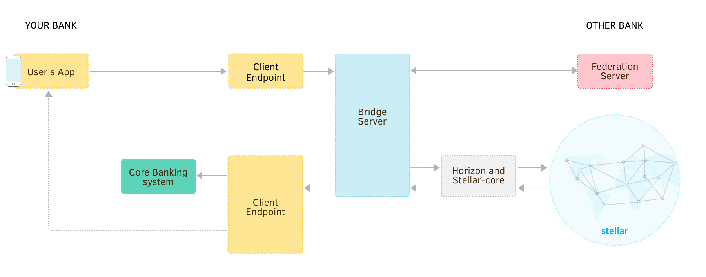
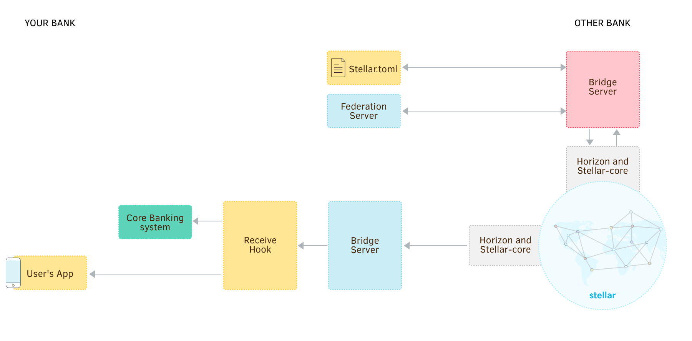

Stellar.org maintains a [bridge server](https://github.com/stellar/bridge-server/blob/master/readme_bridge.md), which simplifies the process of working with federation and compliance servers to send and receive payments. When using the bridge server, you only need to write a small web server to receive payment notifications and respond to regulatory checks from the bridge and compliance servers.




### Create a Database

The bridge server requires a MySQL or PostgreSQL database in order to track and coordinate transaction and compliance information. Create an empty database named `stellar_bridge` and a user to manage it. You don’t need to add any tables; the bridge server will do that itself when it first runs.


### Download and Configure Bridge Server

Next, [download the latest bridge server](https://github.com/stellar/bridge-server/releases) for your platform. Install the executable anywhere you like. In the same directory, create a file named `config_bridge.toml`. This will store the configuration for the bridge server. It should look something like:

```toml
port = 8001
horizon = "https://horizon-testnet.stellar.org"
network_passphrase = "Test SDF Network ; September 2015"
# The API key must be included in all requests to the bridge server.
# Don't share it with anyone who shouldn't have access to the server.
api_key = "CHANGE_THIS"
# We'll fill this in once we set up a compliance server
compliance = ""

# This describes the assets that can be sent and received.
# Repeat this section to add support for more asset types.
[[assets]]
code="USD"
issuer="GAIUIQNMSXTTR4TGZETSQCGBTIF32G2L5P4AML4LFTMTHKM44UHIN6XQ"

[database]
type = "mysql"  # or "postgres" if you created a postgres database
url = "dbuser:dbpassword@/stellar_bridge"

[accounts]
# The secret seed for your base account, from which payments are made
base_seed = "SAV75E2NK7Q5JZZLBBBNUPCIAKABN64HNHMDLD62SZWM6EBJ4R7CUNTZ"
# The account ID that receives payments on behalf of your customers. In this,
# case, it is the same account as `base_seed` above.
receiving_account_id = "GAIGZHHWK3REZQPLQX5DNUN4A32CSEONTU6CMDBO7GDWLPSXZDSYA4BU"
# A secret seed that can authorize trustlines for assets you issue. For more,
# see https://stellar.org/developers/guides/concepts/assets.html#controlling-asset-holders
authorizing_seed = "SBILUHQVXKTLPYXHHBL4IQ7ISJ3AKDTI2ZC56VQ6C2BDMNF463EON65U"
# The ID of the account that issues your assets
issuing_account_id = "GAIUIQNMSXTTR4TGZETSQCGBTIF32G2L5P4AML4LFTMTHKM44UHIN6XQ"

[callbacks]
# The bridge server will send POST requests to these URLs
receive = "http://localhost:8005/receive"
error = "http://localhost:8005/error"
```

Remember to customize `api_key` and fill in the connection string for the database you just created.


### Start the Server

Before starting the server the first time, the tables in your database need to be created. Running bridge server with the `--migrate-db` argument will make sure everything is set to go:

```bash
./bridge --migrate-db
```

Each time you update the bridge server to a new version, you should run this command again. It will upgrade your database in case anything needs to be changed.

Now that your database is fully set up, you can start the bridge server by running:

```bash
./bridge
```


### Send a Payment

The bridge server takes commands in the form of HTTP requests, so we can test that it can submit a payment by sending a `POST` request to `/payments`. Try sending 1 USD to the account `GCFXHS4GXL6BVUCXBWXGTITROWLVYXQKQLF4YH5O5JT3YZXCYPAFBJZB`. (Remember that the receiving account will need to trust the asset. See [issuing assets](../issuing-assets.md) for more details.)

<code-example name="Send a Payment">

```bash
curl -X POST -d \
"amount=1&\
asset_code=USD&\
asset_issuer=GAIUIQNMSXTTR4TGZETSQCGBTIF32G2L5P4AML4LFTMTHKM44UHIN6XQ&\
destination=GCFXHS4GXL6BVUCXBWXGTITROWLVYXQKQLF4YH5O5JT3YZXCYPAFBJZB&\
source=SAV75E2NK7Q5JZZLBBBNUPCIAKABN64HNHMDLD62SZWM6EBJ4R7CUNTZ&\
apiKey=[YOUR API KEY]" \
http://localhost:8001/payment
```

```js
var request = require('request');

request.post({
  url: 'http://localhost:8001/payment',
  form: {
    amount: '1',
    asset_code: 'USD',
    asset_issuer: 'GAIUIQNMSXTTR4TGZETSQCGBTIF32G2L5P4AML4LFTMTHKM44UHIN6XQ',
    destination: 'GCFXHS4GXL6BVUCXBWXGTITROWLVYXQKQLF4YH5O5JT3YZXCYPAFBJZB',
    source: 'SAV75E2NK7Q5JZZLBBBNUPCIAKABN64HNHMDLD62SZWM6EBJ4R7CUNTZ'
  }
}, function(error, response, body) {
  if (error || response.statusCode !== 200) {
    console.error('ERROR!', error || body);
  }
  else {
    console.log('SUCCESS!', body);
  }
});
```

```java
import org.apache.http.HttpEntity;
import org.apache.http.HttpResponse;
import org.apache.http.NameValuePair;
import org.apache.http.client.HttpClient;
import org.apache.http.client.methods.HttpPost;
import org.apache.http.impl.client.HttpClients;
import org.apache.http.message.BasicNameValuePair;
import org.apache.http.util.EntityUtils;

import java.util.ArrayList;
import java.util.List;

public class PaymentRequest() {
  public static void main(String [] args) {
    HttpPost paymentRequest = new HttpPost("http://localhost:8001/payment");

    List<NameValuePair> params = new ArrayList<NameValuePair>();
    params.add(new BasicNameValuePair("amount", "1"));
    params.add(new BasicNameValuePair("asset_code", "USD"));
    params.add(new BasicNameValuePair("asset_issuer", "GAIUIQNMSXTTR4TGZETSQCGBTIF32G2L5P4AML4LFTMTHKM44UHIN6XQ"));
    params.add(new BasicNameValuePair("destination", "GCFXHS4GXL6BVUCXBWXGTITROWLVYXQKQLF4YH5O5JT3YZXCYPAFBJZB"));
    params.add(new BasicNameValuePair("source", "SAV75E2NK7Q5JZZLBBBNUPCIAKABN64HNHMDLD62SZWM6EBJ4R7CUNTZ"));

    HttpResponse response = httpClient.execute(paymentRequest);
    HttpEntity entity = response.getEntity();
    if (entity != null) {
      String body =  EntityUtils.toString(entity);
      System.out.println(body);
    }
  }
}
```

</code-example>


## Create a Server to Receive Payments



In the bridge server configuration file, you might have noticed two callback URLs: `receive` and `error`. Whenever a payment is received or an error occurs, the bridge server will send an HTTP `POST` request to one of those URLs. The main responsibility of the `receive` endpoint is to update your customer’s balance in response to receiving a payment (since the payment went to your account on Stellar).

<code-example name="Implementing the Receive Callback">

```js
/**
 * A small Express.js web server for handling payments from the bridge server.
 */

var express = require('express');
var bodyParser = require('body-parser');

var app = express();
app.use(bodyParser.urlencoded({ extended: false }));

app.get('/receive', function (request, response) {
  var payment = request.body;

  // `receive` may be called multiple times for the same payment, so check that
  // you haven't already seen this payment ID.
  if (getPaymentByIdFromDb(payment.id)) {
    return response.status(200).end();
  }

  // Because we have one Stellar account representing many customers, the
  // customer the payment is intended for should be in the transaction memo.
  var customer = getAccountFromDb(payment.memo);

  // You need to check the asset code and issuer to make sure it's an asset
  // that you can accept payment to this account for. In this example, we just
  // convert the amount to USD and adding the equivalent amount to the customer
  // balance. You need to implement `convertToUsd()` yourself.
  var dollarAmount = convertToUsd(
    payment.amount, payment.asset_code, payment.asset_issuer);
  addToBankAccountBalance(customer, dollarAmount);
  response.status(200).end();
  console.log('Added ' + dollarAmount + ' USD to account: ' + customer);
});

app.get('/error', function (request, response) {
  console.log('Payment error!', request.body);
  response.status(200).end();
});

app.listen(8005, function () {
  console.log('Bridge server hook handler running on port 8002!');
});
```

```java
// TODO: write the example!
```

</code-example>

To test that your receive hook works, let’s try sending 1 USD to a customer with the account name `Amy` at your bank. (For a review of sending payments using the API, check [step 3 of “get started”](../get-started/transactions.md).)

<code-example name="Test Receive Hook">

```js
var StellarSdk = require('stellar-sdk');
var server = new StellarSdk.Server('https://horizon-testnet.stellar.org');
var sourceKeys = StellarSdk.Keypair
  .fromSeed('SCZANGBA5YHTNYVVV4C3U252E2B6P6F5T3U6MM63WBSBZATAQI3EBTQ4');
var destinationId = 'GAIGZHHWK3REZQPLQX5DNUN4A32CSEONTU6CMDBO7GDWLPSXZDSYA4BU';

server.loadAccount(sourceKeys.accountId())
  .then(function(sourceAccount) {
    var transaction = new StellarSdk.TransactionBuilder(sourceAccount)
      .addOperation(StellarSdk.Operation.payment({
        destination: destinationId,
        asset: new StellarSdk.Asset(
          'USD', 'GAIUIQNMSXTTR4TGZETSQCGBTIF32G2L5P4AML4LFTMTHKM44UHIN6XQ'),
        amount: '1'
      }))
      // Use the memo to indicate the customer this payment is intended for
      .addMemo(StellarSdk.Memo.text('Amy'))
      .build();
    transaction.sign(sourceKeys);
    return server.submitTransaction(transaction);
  })
  .then(function(result) {
    console.log('Success! Results:', result);
  })
  .catch(function(error) {
    console.error('Something went wrong!', error);
  });
```

```java
// TODO: write the example!
```

</code-example>
