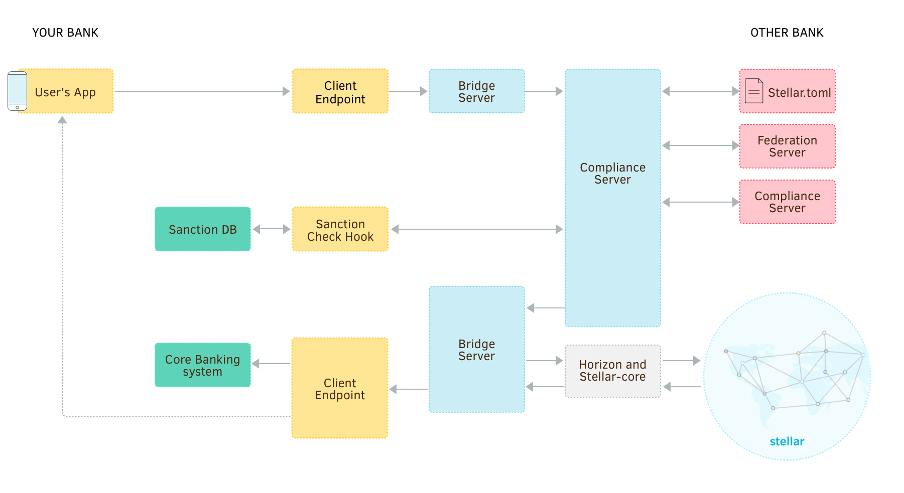
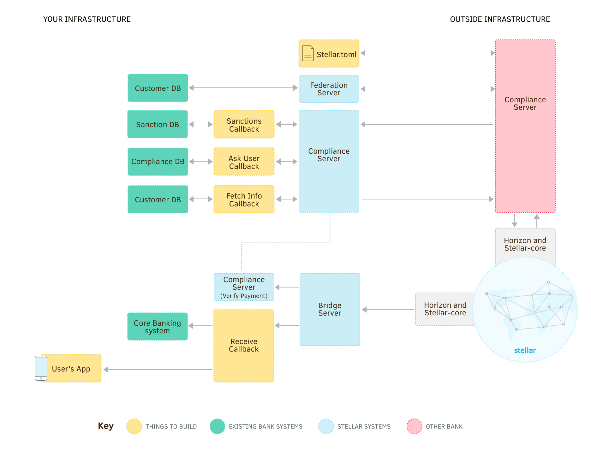

The task of an anchor is handling regulatory compliance, like Anti-Money Laundering (<abbr title="Anti-Money Laundering">AML</abbr>). To accomplish that, you should use the [Stellar compliance protocol](../compliance-protocol.md), a standard way to exchange compliance information and pre-approve a transaction with another financial institution.

You can write your own server that matches the compliance protocol, but Stellar.org also provides a [compliance server](https://github.com/stellar/bridge-server/blob/master/readme_compliance.md) that takes care of most of the work for you.

Your bridge server contacts your compliance server in order to authorize a transaction before sending it. Your compliance server uses the compliance protocol to clear the transaction with the recipient’s compliance server, then lets the bridge server know the transaction is ok to send.



When another compliance server contacts yours to clear a transaction, a series of callbacks are used to check the information with you. Later, when your bridge server receives a transaction, it contacts your compliance server to verify that it was cleared.




## Create a Database

The compliance server requires a MySQL or PostgreSQL database in order to save transaction and compliance information. Create a new database named `stellar_compliance` and a user to manage it. You don’t need to add any tables; the server includes [a command to configure and update your database](#start-the-server).


## Download and Configure Compliance Server

Start by [downloading the latest compliance server](https://github.com/stellar/bridge-server/releases) for your platform and install the executable anywhere you like. In the same directory, create a file named `config_compliance.toml`. This will store the configuration for the compliance server. It should look something like:

<code-example name="config_compliance.toml">

```toml
external_port = 8003
internal_port = 8004
# Set this to `true` if you need to check the information of a person receiving
# a payment you are sending (if false, only the sender will be checked). For
# more information, see the callbacks section below.
needs_auth = false
network_passphrase = "Test SDF Network ; September 2015"

[database]
type = "mysql" # Or "postgres" if you created a PostgreSQL database
url = "dbuser:dbpassword@/stellar_compliance"

[keys]
# This should be the secret seed for your base account (or another account that
# can authorize transactions from your base account).
signing_seed = "SAV75E2NK7Q5JZZLBBBNUPCIAKABN64HNHMDLD62SZWM6EBJ4R7CUNTZ"
encryption_key = "SAV75E2NK7Q5JZZLBBBNUPCIAKABN64HNHMDLD62SZWM6EBJ4R7CUNTZ"

[callbacks]
sanctions = "http://localhost:8005/compliance/sanctions"
ask_user = "http://localhost:8005/compliance/ask_user"
fetch_info = "http://localhost:8005/compliance/fetch_info"

# The compliance server must be available via HTTPS. Specify your SSL
# certificate and key here. If the server is behind a proxy or load  balancer
# that implements HTTPS, you can omit this section.
[tls]
certificate_file = "server.crt"
private_key_file = "server.key"
```

</code-example>

The configuration file lists both an `external_port` and an `internal_port`. The external port must be publicly accessible. This is the port that other organizations will contact in order to determine whether you will accept a payment.

The internal port should *not* be publicly accessible. It is the port through which you initiate compliance operations and transmit private information. It’s up to you to keep this port secure through a firewall, a proxy, or some other means.

You’ll also need to tell your bridge server that you now have a compliance server it can use. Update [`config_bridge.toml`](2-bridge-server.md#download-and-configure-bridge-server) with the address of your compliance server’s *internal* port:

<code-example name="config_bridge.toml">

```toml
port = 8001
horizon = "https://horizon-testnet.stellar.org"
network_passphrase = "Test SDF Network ; September 2015"
compliance = "https://your_org.com:8004"

# ...the rest of your configuration...
```

</code-example>


## Implement Compliance Callbacks

In the server configuration file, there are three callback URLs, much like those for the bridge server. They are HTTP POST URLs that will be sent form-encoded data:

- `fetch_info` is sent a federation address (like `tunde_adebayo*your_org.com`) and should return all the information necessary for another organization to perform compliance checks. It can be any data you deem reasonable and must be formatted as JSON.

    When you are sending a payment, it will be called to get information on the customer who is sending the payment in order to send it to the receiving organization. When receiving a payment, it will be called if the sending organization has requested information on the receiver to do its own compliance checks (based on the [`needs_auth` configuration](#download-and-configure-compliance-server)).

    <code-example name="Implementing the fetch_info callback">

    ```js
    app.post('/compliance/fetch_info', function (request, response) {
      var addressParts = response.body.address.split('*');
      var friendlyId = addressParts[0];

      // You need to create `accountDatabase.findByFriendlyId()`. It should look
      // up a customer by their Stellar account and return account information.
      accountDatabase.findByFriendlyId(friendlyId)
        .then(function(account) {
          // This can be any data you determine is useful and is not limited to
          // these three fields.
          response.json({
            name: account.fullName,
            address: account.address,
            date_of_birth: account.dateOfBirth
          });
          response.end();
        })
        .catch(function(error) {
          console.error('Fetch Info Error:', error);
          response.status(500).end(error.message);
        });
    });
    ```

    ```java
    @POST
    @Path("compliance/fetch_info")
    @Consumes(MediaType.APPLICATION_FORM_URLENCODED)
    @Produces(MediaType.APPLICATION_JSON)
    public Response fetchInfo(
      @FormParam("address") String address) {

      String friendlyId = address.split("\\*", 2)[0];

      // You need to create `accountDatabase.findByFriendlyId()`. It should
      // find customers by their Stellar account and return account information.
      try {
        Account account = accountDatabase.findByFriendlyId(friendlyId);
        return Response.ok(
          // This can be any data you determine is useful and is not limited to
          // these three fields.
          Json.createObjectBuilder()
            .add("name", account.fullName)
            .add("address", account.address)
            .add("date_of_birth", account.dateOfBirth)
            .build())
          .build();
        )
      } catch (Exception error) {
        System.out.println(
          String.format("Could not find account: %s", address));
        return Response.status(500).entity(error.getMessage()).build();
      }
    }
    ```

    </code-example>

- `sanctions` is given information about the person who is sending a payment to you or one of your customers. This is the same data the sending server would have received from its own `fetch_info` callback. The HTTP response code it produces indicates whether the payment will be accepted (status `200`), denied (status `403`), or if you need additional time for processing (status `202`).

    <code-example name="Implementing the sanctions callback">

    ```js
    app.post('/compliance/sanctions', function (request, response) {
      var sender = JSON.parse(request.body.sender);

      // You need to create a function to check whether there are any sanctions
      // against someone.
      sanctionsDatabase.isAllowed(sender)
        .then(function() {
          response.status(200).end();
        })
        .catch(function(error) {
          // In this example, we're assuming `isAllowed` returns an error with a
          // `type` property that indicates the kind of error. Your systems may
          // work differently; just return the same HTTP status codes.
          if (error.type === 'DENIED') {
            response.status(403).end();
          }
          else if (error.type === 'UNKNOWN') {
            // If you need to wait and perform manual checks, you'll have to
            // create a way to do that as well
            notifyHumanForManualSanctionsCheck(sender);
            // The value for `pending` is a time to check back again in seconds
            response.status(202).json({pending: 3600}).end();
          }
          else {
            response.status(500).end(error.message);
          }
        });
    });
    ```

    ```java
    import java.io.*;
    import javax.json.Json;
    import javax.json.JsonObject;
    import javax.json.JsonReader;

    @POST
    @Path("compliance/sanctions")
    @Consumes(MediaType.APPLICATION_FORM_URLENCODED)
    @Produces(MediaType.APPLICATION_JSON)
    public Response sanctions(@FormParam("sender") String sender) {
      JsonReader jsonReader = Json.createReader(new StringReader(sender));
      JsonObject senderData = jsonReader.readObject();
      jsonReader.close();

      // You need to create a function to check whether there are any sanctions
      // against someone.
      Permission permission = sanctionsDatabase.isAllowed(
        senderData.getString("name"),
        senderData.getString("address"),
        senderData.getString("date_of_birth"));

      // In this example, we're assuming `isAllowed` returns a Permissions enum
      // that indicates whether someone is Allowed, Denied, or Unknown. Your
      // systems may work differently; just return the same HTTP status codes.
      if (permission.equals(Permission.Allowed)) {
        return Response.ok().build();
      }
      else if (permission.equals(Permission.Denied)) {
        return Response.status(403).build();
      }
      else {
        // If you need to wait and perform manual checks, you'll have to implent
        // a way to do that as well.
        notifyHumanForManualSanctionsCheck(senderData);
        // The value for `pending` is a time to check back again in seconds.
        return Response.accepted(
          Json.createObjectBuilder()
            .add("pending", 3600)
            .build())
          .build();
      }
    }
    ```

    </code-example>

- `ask_user` is called when receiving a payment if the sender has requested information about the receiver. Its return code indicates whether you will send that information (`fetch_info` is then called to actually *get* the info). It is sent information on both the payment and the sender.

    <code-example name="Implementing the ask_user callback">

    ```js
    app.post('/compliance/ask_user', function (request, response) {
      var sender = JSON.parse(request.body.sender);

      // You can do any checks that make sense here. For example, you may not
      // want to share information with someone who has sanctions as above:
      sanctionsDatabase.isAllowed(sender)
        .then(function() {
          response.status(200).end();
        })
        .catch(function(error) {
          if (error.type === 'UNKNOWN') {
            // If you need to wait and perform manual checks, you'll have to
            // create a way to do that as well.
            notifyHumanForManualInformationSharing(sender);
            // The value for `pending` is a time to check back again in seconds
            response.status(202).json({pending: 3600}).end();
          }
          else {
            response.status(403).end();
          }
        });
    });
    ```

    ```java
    @POST
    @Path("compliance/ask_user")
    @Consumes(MediaType.APPLICATION_FORM_URLENCODED)
    @Produces(MediaType.APPLICATION_JSON)
    public Response askUser(@FormParam("sender") String sender) {
      JsonReader jsonReader = Json.createReader(new StringReader(sender));
      JsonObject senderData = jsonReader.readObject();
      jsonReader.close();

      // You can do any checks that make sense here. For example, you may not
      // want to share information with someone who has sanctions as above:
      Permission permission = sanctionsDatabase.isAllowed(
        senderData.getString("name"),
        senderData.getString("address"),
        senderData.getString("date_of_birth"));

      if (permission.equals(Permission.Allowed)) {
        return Response.ok().build();
      }
      else if (permission.equals(Permission.Denied)) {
        return Response.status(403).build();
      }
      else {
        // If you need to wait and perform manual checks, you'll have to create
        // a way to do that as well.
        notifyHumanForManualInformationSharing(senderData);
        // The value for `pending` is a time to check back again in seconds.
        return Response.accepted(
          Json.createObjectBuilder()
            .add("pending", 3600)
            .build())
          .build();
      }
    }
    ```

    </code-example>

To keep things simple, we’ll add all three callbacks to the same server we are using for the bridge server callbacks. However, you can implement them on any service that makes sense in your infrastructure. Just make sure they’re reachable at the URLs in your config file.


## Update Stellar.toml

When other organizations need to contact your compliance server to authorize a payment to one of your customers, they consult your domain’s `stellar.toml` file for the address, just as when finding your federation server.

For compliance operations, you’ll need to list two new properties in your `stellar.toml`:

<code-example name="stellar.toml">

```toml
FEDERATION_SERVER = "https://www.your_org.com:8002/federation"
AUTH_SERVER = "https://www.your_org.com:8003"
SIGNING_KEY = "GAIGZHHWK3REZQPLQX5DNUN4A32CSEONTU6CMDBO7GDWLPSXZDSYA4BU"
```

</code-example>

`AUTH_SERVER` is the address for the *external* port of your compliance server. Like your federation server, this can be any URL you like, but **it must support HTTPS and use a valid SSL certificate.**[^ssl]

`SIGNING_KEY` is the public key that matches the secret seed specified for `signing_seed` in your compliance server’s configuration. Other organizations will use it to verify that messages were actually sent by you.


## Start the Server

Before starting the server the first time, the tables in your database need to be created. Running compliance server with the `--migrate-db` argument will make sure everything is set to go:

```bash
./compliance --migrate-db
```

Each time you update the compliance server to a new version, you should run this command again. It will upgrade your database in case anything needs to be changed.

Now that your database is fully set up, you can start the compliance server by running:

```bash
./compliance
```


## Try It Out

Now that you’ve got your compliance server set up and ready to verify transactions, you’ll want to test it by sending a payment to someone who is running their own compliance and federation servers.

The easiest way to do this is to simply test a payment from one of your own customers to another. Your compliance, federation, and bridge servers will perform both the sending and receiving sides of the transaction.

Send a payment through your bridge server, but this time, use federated addresses for the sender and receiver and an `extra_memo`[^compliance_memos] to trigger compliance checks:

<code-example name="Send a Payment">

```bash
# NOTE: `extra_memo` is required for compliance (use it instead of `memo`)
curl -X POST -d \
"amount=1&\
asset_code=USD&\
asset_issuer=GAIUIQNMSXTTR4TGZETSQCGBTIF32G2L5P4AML4LFTMTHKM44UHIN6XQ&\
destination=amy*your_org.com&\
source=SAV75E2NK7Q5JZZLBBBNUPCIAKABN64HNHMDLD62SZWM6EBJ4R7CUNTZ&\
sender=tunde_adebayo*your_org.com&\
extra_memo=Test%20transaction" \
http://localhost:8001/payment
```

```js
var request = require('request');

request.post({
  url: 'http://localhost:8001/payment',
  form: {
    amount: '1',
    asset_code: 'USD',
    asset_issuer: 'GAIUIQNMSXTTR4TGZETSQCGBTIF32G2L5P4AML4LFTMTHKM44UHIN6XQ',
    destination: 'amy*your_org.com',
    source: 'SAV75E2NK7Q5JZZLBBBNUPCIAKABN64HNHMDLD62SZWM6EBJ4R7CUNTZ',
    sender: 'tunde_adebayo*your_org.com',
    // `extra_memo` is required for compliance (use it instead of `memo`)
    extra_memo: 'Test transaction',
  }
}, function(error, response, body) {
  if (error || response.statusCode !== 200) {
    console.error('ERROR!', error || body);
  }
  else {
    console.log('SUCCESS!', body);
  }
});
```

```java
import org.apache.http.HttpEntity;
import org.apache.http.HttpResponse;
import org.apache.http.NameValuePair;
import org.apache.http.client.HttpClient;
import org.apache.http.client.methods.HttpPost;
import org.apache.http.impl.client.HttpClients;
import org.apache.http.message.BasicNameValuePair;
import org.apache.http.util.EntityUtils;

import java.util.ArrayList;
import java.util.List;

public class PaymentRequest() {
  public static void main(String [] args) {
    HttpPost paymentRequest = new HttpPost("http://localhost:8001/payment");

    List<NameValuePair> params = new ArrayList<NameValuePair>();
    params.add(new BasicNameValuePair("amount", "1"));
    params.add(new BasicNameValuePair("asset_code", "USD"));
    params.add(new BasicNameValuePair("asset_issuer", "GAIUIQNMSXTTR4TGZETSQCGBTIF32G2L5P4AML4LFTMTHKM44UHIN6XQ"));
    params.add(new BasicNameValuePair("destination", "amy*your_org.com"));
    params.add(new BasicNameValuePair("source", "SAV75E2NK7Q5JZZLBBBNUPCIAKABN64HNHMDLD62SZWM6EBJ4R7CUNTZ"));
    params.add(new BasicNameValuePair("sender", "tunde_adebayo*your_org.com"));
    // `extra_memo` is required for compliance (use it instead of `memo`)
    params.add(new BasicNameValuePair("extra_memo", "Test transaction"));

    HttpResponse response = httpClient.execute(paymentRequest);
    HttpEntity entity = response.getEntity();
    if (entity != null) {
      String body =  EntityUtils.toString(entity);
      System.out.println(body);
    }
  }
}
```

</code-example>

For a more realistic test, set up a duplicate copy of your bridge, federation, and compliance servers at a different domain and send a payment to them!

<nav class="sequence-navigation">
  <a rel="prev" href="3-federation-server.md">Back: Federation Server</a>
  <a rel="next" href="5-conclusion.md">Next: Next Steps</a>
</nav>


[^compliance_memos]: Compliance transactions with the bridge server don’t support the `memo` field. The actual transaction’s `memo` will store a hash used to verify that the transaction submitted to the Stellar network matches the one agreed upon during initial compliance checks. Your `extra_memo` data will be transmitted instead during the compliance checks. For details, see [the compliance protocol](../compliance-protocol.md).

[^ssl]: Requiring that public services are available via SSL helps keep things secure. While testing, you can get free certificates from http://letsencrypt.org. You can also generate your own self-signed certificates, but you must add them to all the computers in your tests.
