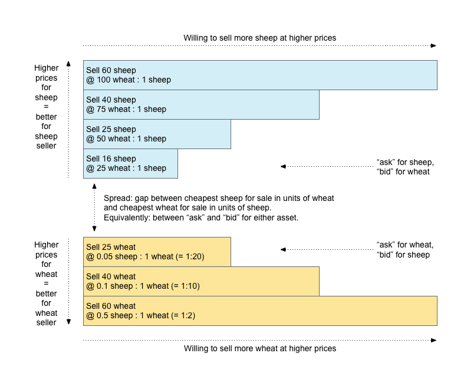

In addition to supporting the issuing and movement of [assets](./assets.md), the Stellar network also acts as a decentralized **distributed exchange** of any type of asset that people have added to the network. Its ledger stores both balances held by user accounts and offers that user accounts make to buy or sell assets.

## Offers
An account can make offers to buy or sell assets using the [Manage Buy
Offer](./list-of-operations.md#manage-buy-offer) or [Manage Sell
Offer](./list-of-operations.md#manage-sell-offer) operation. In order to make an offer, the account
must hold the asset it wants to sell. Similarly, the account must trust the issuer of the asset
it's trying to buy.

When an account makes an offer, the offer is checked against the existing orderbook for that asset pair. If the offer crosses an existing offer, it is filled at the price of the existing offer. Let's say that you make an offer to buy 10 XLM for 2 BTC. If an offer already exists to sell 10 XLM for 2 BTC, your offer will take that offer--you'll be 2 BTC poorer but 10 XLM richer.

If the offer doesn't cross an existing offer, the offer is saved in the orderbook until it is either taken by another offer, taken by a payment, canceled by the account that created the offer, or invalidated because the account making the offer no longer has the asset for sale.

Starting in protocol version 10, it is no longer possible for an offer to be invalidated because the account owning the offer no longer has the asset for sale. Each offer contributes selling liabilities for the selling asset and buying liabilities for the buying asset, which are aggregated in the account (for lumens) or trustline (for other assets) owned by the account creating the offer. Any operation that would cause an account to be unable to satisfy its liabilities, such as sending away too much balance, will fail. This guarantees that any offer in the orderbook can be executed entirely.

Offers in Stellar behave like limit orders in traditional markets.

For offers placed at the same price, the older offer is filled before the newer one.

### Price

Each offer in Stellar has an associated price with it, which is represented as a ratio of the
two assets in the offer. This is to ensure there is no loss of precision when representing the
price of the offer (as opposed to storing the fraction as a floating-point number).

Prices are specified as a `{numerator, denominator}` pair, with both components of the fraction
represented as 32 bit signed integers. When expressing a price of "Asset A in terms of Asset B",
the amount of B is always the numerator, and A is always the denominator.

When creating a "buy"/"bid" offer in Stellar via the [Manage Buy
Offer](./list-of-operations.md#manage-buy-offer) operation, the price is specified as 1 unit of
what you're _buying_ in terms of what you're _selling_. For example, if you were _buying_ 20 USD in
exchange for 100 XLM, you would specify the price as `{100, 20}`, which would be the equivalent of
1 USD @ 5 XLM.

When creating a "sell"/"offer"/"ask" offer in Stellar via the [Manage Sell
Offer](./list-of-operations.md#manage-sell-offer) operation, the price is specified as 1
unit of what you're _selling_ in terms of what you're _buying_. For example, if you were _selling_
10 USD in exchange for 100 XLM, you would specify the price as `{100, 10}`, which would be the
equivalent of 1 USD @ 10 XLM (_nice profit_).

#### Fees

It's important to note that the price you set is unrelated to the fee you pay for submitting the
offer as a part of a transaction. In fact, it's absolutely possible it's in a different asset! This
is because on the Stellar network fees are always paid in the native currency of the network
(lumens), and are related to the transaction that you submit to the network (which contains your
offer operation) as opposed to your offer itself.

It's up to you to calculate fees into how you craft the price on your offer. Here's an example:

* You place an offer to _buy_ 100 USD for 135 CAD with a fee of 1000
  [stroops](./assets.md#one-stroop-multiple-stroops) (.0001 XLM). You immediately lose .0001
  XLM.
* When your offer is accepted by a seller, you receive 100 USD and exchange 135 CAD in return.
* In total, your gain is 100 USD, and your loss is 135 CAD _and_ .0001 XLM.

For more information, take a look at [our guide on fees in Stellar](./fees.md).

## Orderbook
An **orderbook** is a record of outstanding orders on the Stellar network. This record sits between any two assets. Abstractly, we often discuss assets using two _fictional placeholder_ assets traded in a market, which we call "**wheat**" or "**sheep**". The orderbook for that asset-pair therefore records every account wanting to sell wheat for sheap on one side _and_ every account wanting to sell sheep for wheat on the other side.

(A bit of further market terminology: outside of Stellar, the concept of an "orderbook" normally contains two kinds of "**order**": buying is expressed by "**bid**" orders, and selling is expressed by "**ask**" orders, also called "**offers**". Within the Stellar network, the representation of orders is simplified: all orders are stored as **selling** -- i.e. the system automatically converts all bids to asks in the opposite direction -- and Stellar's documentation and code can therefore sometimes be a bit lax in using the words "offer" and "order" as synonyms. Since both words refer to the same thing in Stellar in all cases, they are occasionally used interchangably. This is harmless in the context of the Stellar ecosystem, but outside that context, an "offer" usually means an "ask" order _specifically_!)

An orderbook can be summarized by a diagram, as shown below. It is often visible on the trading interface of an exchange, though sometimes inverted left-to-right or drawn horizontally. But the idea is the same.

The diagram is split into two stacks of orders. Each stack is the the set of orders related to selling an asset _in a trading pair_ with the other asset. So at the top of the diagram there are the orders of people trying to sell sheep (or, equivalently, buy wheat). At the bottom there are the orders of people trying to sell wheat (or, equivalently, buy sheep).

For mnemonic purposes we've arranged the diagram with the sheep "on top" of the wheat here. If it helps you can picture a bunch of sheep standing on a field of wheat or some bushels of wheat, an arrangement less likely to cause chaos than trying to stack bushels of wheat on top of sheep.

Looking at the diagram, there are a few orientation things to notice and think about:

  1. Being willing to sell wheat for sheep is _exactly the same_ as being willing to buy sheep for wheat. There are differences once we get into which direction of price movement you'll accept as "better than your order", but in general it's just a question of which unit you declare the price and quantity for, so for uniformity sake, our order book encodes orders on both sides of a trading pair as as _selling_.

  2. Generally more people will be willing to _sell_ more of an asset at higher sale prices. This _makes sense_ intuitively, an embodiment of the notion that "everybody has a price". Not everyone will sell their favourite shoes for $100, but probably everyone will for $1,000 or $10,000. Put another way: higher sale prices for an asset are "better" for people trying to sell it. If you're _selling_ at some price "or better", that means "or higher prices". (Equivalently: "or better" means "or _lower_ price" for _buyers_, but again, we model both sides here as _sellers_). Similarly there is (intuitively) a lowest price at which _anyone_ wants to sell an asset, and likely there aren't _many_ people who want to offer it at that cheapest price. So orders naturally "thin out" toward the center where it wouldn't be especially appealing to bother selling, and "widen out" towards the edges where the prices (should they occur) would be tempting for lots of people to sell at.

  3. At any given moment, the order _book_ (this diagram) contains all the orders that are _not_ "**matched**", i.e. that cannot be executed because the prices offered are not acceptably good to parties on either side to make a trade. Orders recorded in the book are the unmatched _residue_ of orders submitted for trading. In other words, when someone submits a new order, the exchange matching engine will compare it to the orders in the book and _execute_ any part it can, swapping assets from the parties involved and effectively _deleting the intersection_ of the submitted order and the order book from both, writing only the _symmetric difference_ of them back into the book. Orders that _do_ match (and should be executed / symmetric-differenced) are also called "**crossing orders**" (because they occur when the upper and lower parts of the diagram intersect, or _cross_), and sometimes this term is used as a verb, and the entire act of matching and executing is called "**crossing**" a pair of orders/offers.

  4. Because the set of orders is not perfectly smooth -- there is not necessarily every possible quantity of an asset on offer at every possible price -- deleting the symmetric difference of matching orders is likely to open up a _gap_ between the _remaining_ cheapest offers (if there are any!) in either direction of the trading pair. This gap is the **spread** in the pair. The size of the spread will vary depending on quantity and variability of prices asked by sellers: a sparse or highly variably-priced set of offers will produce a bigger spread.

Some assets will have a very thin or nonexistent orderbook between them. That's fine: as discussed in greater detail below, paths of orders can facilitate exchange between two thinly traded assets.

## Passive Offers
**Passive offers** allow markets to have zero spread. If you want to offer USD from anchor A for
USD from anchor B at a 1:1 price, you can create two passive offers so the two offers don't fill
each other.

A passive offer is an offer that does not take a counteroffer of equal price. It will only fill if
the prices are not equal. For example, if the best offer to buy BTC for XLM has a price of
100XLM/BTC, and you make a passive offer to sell BTC at 100XLM/BTC, your passive offer *does not*
take that existing offer. If you instead make a passive offer to sell BTC at 99XLM/BTC it would
cross the existing offer and fill at 100XLM/BTC.

An account can place a passive sell offer via the
[Create Passive Sell Offer](./list-of-operations.md#create-passive-sell-offer) operation.

## Cross-asset payments
Suppose you are holding sheep and want to buy something from a store that only accepts wheat. You can create a payment in Stellar that will automatically convert your sheep into wheat. It goes through the sheep/wheat orderbook and converts your sheep at the best available rate.

You can also make more complicated paths of asset conversion. Imagine that the sheep/wheat orderbook has a very large spread or is nonexistent. In this case, you might get a better rate if you first trade your sheep for brick and then sell that brick for wheat. So a potential path would be 2 hops: sheep->brick->wheat. This path would take you through the sheep/brick orderbook and then the brick/wheat orderbook.

These paths of asset conversion can contain up to 6 hops, but the whole payment is atomic--it will either succeed or fail. The payment sender will never be left holding an unwanted asset.

This process of finding the best path of a payment is called **pathfinding**. Pathfinding involves looking at the current orderbooks and finding which series of conversions gives you the best rate. It is handled outside of Stellar Core by something like Horizon.

## Preferred currency
Because cross-asset payments are so simple with Stellar, users can keep their money in whatever asset they prefer to hold. **Preferred currency** creates a very flexible, open system.

Imagine a world where, anytime you travel, you never have to exchange currency except at the point of sale. A world where you can choose to keep all your assets in, for example, Google stock, cashing out small amounts as you need to pay for things. Cross-asset payments make this world possible.

