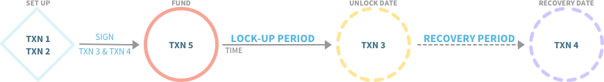
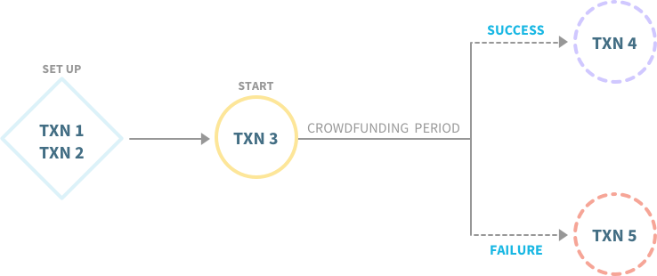

Stellar can be used to build sophisticated smart contracts. Smart contracts are computer programs that can automatically execute an agreement based on programmed logic.

The concept of integrating technology and legal contracts dates back to the 1950s when scholars built computational methods that could enforce legal rules without involving traditional legal processes. Smart contracts were formally defined by Nick Szabo in 1997:

> Smart contracts combine protocols with user interfaces to formalize and secure relationships over computer networks. Objectives and principles for the design of these systems are derived from legal principles, economic theory, and theories of reliable and secure protocols. 

In recent years, blockchain technology has enabled a new breed of smart contracts with immutable storage of agreement terms, cryptographic authorization, and integrated transfers of value. 

For the Stellar Network, smart contracts are manifested as Stellar Smart Contracts. A **Stellar Smart Contract** (SSC) is expressed as compositions of transactions that are connected and executed using various constraints. The following are examples of constraints that can be considered and implemented when creating SSCs:

- *Multisignature* - What keys are needed to authorize a certain operation? What parties need to agree on a circumstance in order to execute the steps?

Multisignature is the concept requiring signatures of multiple parties to sign transactions stemming from an account. Through signature weights and thresholds, representation of power in signatures is created. 

- *Batching/Atomicity* - What operations must all occur together or fail? What must happen in order to force this to fail or pass?

Batching is the concept of including multiple operations in one transaction. Atomicity is the guarantee that given a series of operations, upon submission to the network if one operation fails, all operation in the transaction fails. 

- *Sequence* - In what order should a series of transactions be processed? What are the limitations and dependencies?

The concept of sequence is represented on the Stellar Network through sequence number. Utilizing sequence numbers in transaction manipulation, it can be guaranteed that specific transactions do not succeed if an alternative transaction is submitted. 

- *Time Bounds* - When can a transaction be processed?

Time bounds are limitations on the time period over which a transaction is valid. Using time bounds enables time periods to be represented in an SSC. 

This overview presents two common design patterns that can be used to create SSCs on the Stellar Network. The transactions can be translated to API requests or can be executed using [Stellar Laboratory](https://www.stellar.org/laboratory/).

## 2-Party Multisignature Escrow Account with Time Lock & Recovery
### Use Case Scenario
Ben Bitdiddle sells 50 CODE tokens to Alyssa P. Hacker, under the condition that Alyssa won’t resell the tokens until one year has passed. Ben doesn’t completely trust Alyssa so he suggests that he holds the tokens for Alyssa for the year.

Alyssa protests. How will she know that Ben will still have the tokens after one year? How can she trust him to eventually deliver them?

Additionally, Alyssa is sometimes forgetful. There’s a chance she won’t remember to claim her tokens at the end of the year long waiting period. Ben would like to build in a recovery mechanism so that if Alyssa doesn’t claim the tokens, they can be recovered. This way, the tokens won’t be lost forever.

### Implementation
An escrow agreement is created between two entities: the origin - the entity funding the agreement, and the target - the entity receiving the funds at the end of the contract. 

Three accounts are required to execute a time-locked escrow contract between the two parties: a source account, a destination account, and an escrow account. The source account is the account of the origin that is initializing and funding the escrow agreement. The destination account is the account of the target that will eventually gain control of the escrowed funds. The escrow account is created by the origin and holds the escrowed funds during the lock up period. 

Two periods of time must be established and agreed upon for this escrow agreement: a lock-up period, during which neither party may manipulate (transfer, utilize) the assets, and a recovery period, after which the origin has the ability to recover the escrowed funds from the escrow account. 

Five transactions are used to create an escrow contract - they are explained below in the order of creation. The following variables will be used in the explanation:
-  **N**, **M** - sequence number of escrow account and source account, respectively; N+1 means the next sequential transaction number, and so on
- **T** - the lock-up period
- **D** - the date upon which the lock-up period starts
- **R** - the recovery period

For the design pattern described below, the asset being exchanged is the native asset. The order of submission of transactions to the Stellar network is different from the order of creation. The following shows the submission order, in respect to time: 

#### Transaction 1: Creating the Escrow Account
**Account**: source account  
**Sequence Number**: M  
**Operations**:
- [Create Account](../concepts/list-of-operations.md#create-account): create escrow account in system
	 - starting balance: [minimum balance](../concepts/fees.md#minimum-account-balance) + [transaction fee](../concepts/fees.md#transaction-fee)

**Signers**: source account

Transaction 1 is submitted to the network by the origin via the source account. This creates the escrow account, funds the account with the current minimum reserve, and gives the origin access to the public and private key of the escrow account. The escrow account is funded with the minimum balance so it is a valid account on the network. It is given additional money to handle the transfer fee of transferring the assets at the end of the escrow agreement. It is recommended that when creating new accounts to fund the account with a balance larger than the calculated starting balance.

#### Transaction 2: Enabling Multi-sig
**Account**: escrow account   
**Sequence Number**: N  
**Operations**:
- [Set Option - Signer](../concepts/list-of-operations.md#set-options): Add the destination account as a signer with weight on transactions for the escrow account
	 - weight: 1
- [Set Option - Thresholds & Weights](../concepts/list-of-operations.md#set-options): set weight of master key and change thresholds weights to require all signatures (2 of 2 signers)
	 - master weight: 1
	 - low threshold: 2
	 - medium threshold: 2
	 - high threshold: 2 

**Signers**: escrow account

Transaction 2 is created and submitted to the network. It is done by the origin using the escrow account, as origin has control of the escrow account at this time. The first operation adds the destination account as a second signer with a signing weight of 1 to the escrow account. 

By default, the thresholds are uneven. The second operation sets the weight of the master key to 1, leveling out its weight with that of the destination account. In the same operation, the thresholds are set to 2. This makes is so that all and any type of transactions originating from the escrow account now require all signatures to have a total weight of 2. At this point, the weight of signing with both the escrow account and the destination account adds up to 2. This ensures that from this point on, both the escrow account and the destination account (the origin and the target) must sign all transactions that regard the escrow account. This gives partial control of the escrow account to the target. 

#### Transaction 3: Unlock  
**Account**: escrow account  
**Sequence Number**: N+1  
**Operations**:
- [Set Option - Thresholds & Weights](../concepts/list-of-operations.md#set-options): set weight of master key and change thresholds weights to require only 1 signature
	 - master weight: 0
	 - low threshold: 1
	 - medium threshold: 1
	 - high threshold: 1 

**Time Bounds**:
- minimum time: unlock date
- maximum time: 0  

**Immediate Signer**: escrow account  
**Eventual Signer**: destination account

#### Transaction 4: Recovery 
**Account**: escrow account  
**Sequence Number**: N+1  
**Operations**:
- [Set Option - Signer](../concepts/list-of-operations.md#set-options): remove the destination account as a signer
	 - weight: 0  
 - [Set Option - Thresholds & Weights](../concepts/list-of-operations.md#set-options): set weight of master key and change thresholds weights to require only 1 signature
	 - low threshold: 1
	 - medium threshold: 1
	 - high threshold: 1  

**Time Bounds**:
- minimum time: recovery date
- maximum time: 0

**Immediate Signer**: escrow account  
**Eventual Signer**: destination account  

Transaction 3 and Transaction 4 are created and signed by the escrow account by the origin. The origin then gives Transaction 3 and Transaction 4, in [XDR form](https://www.stellar.org/developers/horizon/reference/xdr.html), to the target to sign using the destination account. The target then publishes them for the origin to [review](https://www.stellar.org/laboratory/#xdr-viewer?type=TransactionEnvelope&network=test) and save in a safe location. Once signed by both parties, these transactions cannot be modified. Both the origin and target must retain a copy of these signed transactions in their XDR form, and the transactions can be stored in a publicly accessible location without concerns of tampering.

Transaction 3 and Transaction 4 are created and signed before the escrow account is funded, and have the same transaction number. This is done to ensure that the two parties are in agreement. If circumstances were to change before one of these two transactions are submitted, both the origin and the target need to authorize transactions utilizing the escrow account. This is represented by the requirement of the signatures of both the destination account and the escrow account. 

Transaction 3 removes the escrow account as a signer for transactions generated from itself. This transaction transfers complete control of the escrow account to target. After the end of the lock-up time period, the only account that is needed to sign for transactions from the escrow account is the destination account. The unlock date (D+T) is the first date that the unlock transaction can be submitted. If Transaction 3 is submitted before the unlock date, the transaction will not be valid. The maximum time is set to 0, to denote that the transaction does not have an expiration date. 

Transaction 4 is for account recovery in the event that target does not submit the unlock transaction. It removes the destination account as a signer, and resets the weights for signing transactions to only require its own signature. This returns complete control of the escrow account to the origin. Transaction 4 can only be submitted after the recovery date (D+T+R), and has no expiration date. 

Transaction 3 can be submitted at any time during the recovery period, R. If the target does not submit Transaction 3 to enable access to the funds in the escrow account, the origin can submit Transaction 4 after the recovery date. The origin can reclaim the locked up assets if desired as Transaction 4 makes it so the target is no longer required to sign transactions for escrow account. After the recovery date, both Transaction 3 and Transaction 4 are valid and able to be submitted to the network but only one transaction will be accepted by the network. This is ensured by the feature that both transactions have the same sequence number. 

To summarize: if Transaction 3 is not submitted by the target, then Transaction 4 is submitted by the origin after the recovery period.

#### Transaction 5: Funding  
**Account**: source account  
**Sequence Number**: M+1  
**Operations**:
- [Payment](../concepts/list-of-operations.md#payment): Pay the escrow account the appropriate asset amount  

**Signer**: source account

Transaction 5 is the transaction that deposits the appropriate amount of assets into the escrow account from the source account. It should be submitted once Transaction 3 and Transaction 4 have been signed by the destination account and published back to the source account.

## Joint-Entity Crowdfunding 
### Use Case Scenario
Alyssa P. Hacker needs to raise money to pay for a service from a company, Coding Tutorials For Dogs, but she wants to source the funding from the public via crowdfunding. If enough people donate, she will be able to pay for the service directly to the company. If not, she will have a mechanism to return the donations. To guarantee her trustworthiness and reliability to the donors, she decides to asks Ben Bitdiddle if he’s willing to help her with getting people to commit to the crowdfunding. He will also vouch for Alyssa’s trustworthiness to his friends as a way to get them to donate to the crowdfunding efforts. 

### Pattern Implementation
In the simplest example, a crowdfunding smart contract requires at least three parties: two of which (from here out called party A and party B) agree to sponsor the crowdfunding, and a third to which the final funds will be given (called the target). A token must be created as the mechanism to execute the crowdfunding. The participation token utilized, as well as a holding account, must be created by one of two parties. A holding account issues participation tokens that can be priced at any value per token. The holding account collects the funding, and, after the end of the crowdfunding period, will return contributors funds if the value goal isn't met. 

Five transactions are used to create a crowdfunding contract. The following variables are used in explaining the formulation of the contract:
- **N**, **M** - sequence number of party A's account and the holding account, respectively; N+1 means the next sequential transaction number, and so on
- **V** - total value the crowdfunding campaign is looking to raise
- **X** - value at which the tokens will be sold

There are four accounts used for creating a basic crowdfunding schema. First is the holding account, which is the account that deals with collecting and interacting with the donors. It requires the signature of both party A and party B in order to carry out any transactions. The second is the goal account, the account owned by the target to which the crowdfunded value is delivered to on success. The other two are the accounts owned by party A and party B, who are running the crowdfunding. 

The transactions that create this design pattern can be created and submitted by any party sponsoring the crowdfunding campaign. The transactions are presented in order of creation. The order of submission to the Stellar Network is conditional, and depends on the success of the crowdfunding campaign.

#### Transaction 1: Create the Holding Account
**Account**: party A  
**Sequence Number**: M  
**Operations**:
- [Create Account](../concepts/list-of-operations.md#create-account): create holding account in system
	- [starting balance](../concepts/fees.md#minimum-account-balance): minimum balance

**Signers**: party A

#### Transaction 2: Add signers
**Account**: holding account  
**Sequence Number**: N  
**Operations**:
 - [Set Option - Signer](../concepts/list-of-operations.md#set-options): Add party A as a signer with weight on transactions for the escrow account
	- weight: 1
 - [Set Option - Signer](../concepts/list-of-operations.md#set-options): Add party B as a signer with weight on transactions for the escrow account
	- weight: 1
 - [Set Option - Thresholds & Weights](../concepts/list-of-operations.md#set-options): remove master keys and change thresholds weights to require all other signatures (2 of 2 signers)
	- master weight: 0
	- low threshold: 2
	- medium threshold: 2
	- high threshold: 2

**Signers**: holding account

Transaction 1 and 2 are created and submitted by one of the two parties sponsoring the crowdfunding campaign. Transaction 1 creates the holding account. The holding account is funded with a starting balance in order to make it valid on the network. it is recommended that when creating new accounts to fund the account with a balance larger than the calculated starting balance. Transaction 2 removes the holding account as a signer for its own transactions, and adds party A and party B as signers. From this point on, all parties involved must agree and sign all transactions coming from the holding account. This trust mechanism is in place to protect donors from one party carrying malicious actions.  

After Transaction 2, the holding account should be funded with the tokens to be used for the crowdfunding campaign, as well as with enough lumens to cover the transaction fees for all of the following transactions. 

#### Transaction 3: Begin Crowdfunding
**Account**: holding account  
**Sequence Number**: N+1  
**Operations**:
- [Manage Offer - Sell](../concepts/list-of-operations.md#manage-offer): sell participation tokens at a rate of X per token

**Signer**: party A’s account, party B’s account

Transaction 3 is created and submitted to the network to begin the crowdfunding campaign. It creates an offer on the network that sells the participation tokens at a rate of X per token. Given a limited amount of tokens are created for the crowdfunding campaign, the tokens are priced in a manner that enables a total of V to be raised through sales. 

#### Transaction 4: Crowdfunding Succeeds  
**Account**: holding account  
**Sequence Number**: N+2    
**Operations**:
- [Payment](../concepts/list-of-operations.md#payment): send V from the holding account to the goal account

**Time Bounds**: 
- minimum time: end of crowdfunding period
- maximum time: 0

**Signers**: party A’s account, party B’s account

#### Transaction 5: Crowdfunding Fails
**Account**: holding account    
**Sequence Number**: N+3      
**Operations**: 
- [Manage Offer - Cancel](../concepts/list-of-operations.md#manage-offer): cancel pre-existing offer to sell tokens 
 - [Manage Offer - Buy](../concepts/list-of-operations.md#manage-offer): holding account buys participation tokens at a rate of X per token

**Time Bounds**:
- minimum time: end of crowdfunding period
- maximum time: 0

**Signers**: party A’s account, party B’s account  

Transaction 4 and Transaction 5 are pre-signed, unsubmitted transactions that are published. Both transactions have a minimum time of the end of the crowdfunding period to prevent them from being submitted earlier than agreed upon by the sponsoring parties. They can be submitted by anyone upon the end of the crowdfunding. Transaction 4 transfers the raised amount to the goal account. Transaction 5 prevents all remaining tokens from being sold by canceling the offer and enables donors to create offers to sell back tokens to the holding account.

Security is provided through sequence numbers. As noted, the sequence number for Transaction 4 is *N+2* and the sequence number for Transaction 5 is *N+3*. These sequential sequence numbers demand that both Transaction 4 and Transaction 5 are submitted to the network in the appropriate order.  

The crowdfunding was a failure when not enough funds was raised by the expected date. This is the equivalent to not selling all of the participation tokens. Transaction 4 is submitted to the network, but it will fail. The holding account will have enough lumens to pay the transaction fee, so the transaction will be considered in consensus and a sequence number will get consumed. An error will occur, though, because there will not be enough funds in the account to cover the actual requested amount of the payment. Transaction 5 is then submitted to the network, enabling contributors to sell back their tokens. Additionally, Transaction 5 cancels the holding account’s ability to sell participation tokens, halting the status of the crowdfunding event.  

The crowdfunding is a success if V was raised by the appropriate time. Raising enough funds is equivalent to having all participation tokens being purchased from the holding account. Transaction 4 is submitted to the network and will succeed because there are enough funds present in the account to fulfill the payment operation, as well as cover the transaction fee. Transaction 5 will then be submitted to the network, but will fail. The holding account will have enough lumens to pay the transaction fee, so the transaction will be considered in consensus and a sequence number will get consumed. The transaction will succeed, but because the holding account will not have the funds to buy back the tokens, participants will not be able to make attempts to recover their funds. 

#### Bonus: Crowdfunding Contributors
The following steps are carried out in order to become a contributor to the crowdfunding:
1. [Create a trustline](../concepts/list-of-operations.md#change-trust) to the holding account for participation tokens
	- The trustline creates trust between the contributor and the holding accounts, enabling transactions involving participation tokens to be valid
2. [Create an offer](../concepts/list-of-operations.md#manage-offer) to buy participation tokens to buy participation tokens
	- The contributor account will receive participation tokens and the holding account will receive the value
3. If the crowdfunding:
	- succeeds - do nothing
	- fails - create an offer to sell participation tokens, enabling the contributor to get back their value invested

## SSC Best Practices
When it comes to designing a smart contract, parties must come together and clearly outline the purpose of the contract, the cooperation between parties, and the desired outcomes. In this outline, clear conditions and their outcomes should be agreed upon. After establishing the conditions and their outcomes, the contract can then be translated to a series of operations and transactions. As a reminder, smart contracts are created using code. Code can contain bugs or may not perform as intended. Be sure to analyze and agree upon all possible edge cases when coming up with the conditions and outcomes of the smart contract. 

## Resources

- [Jurimetrics - The Next Steps Forward](http://heinonline.org/HOL/LandingPage?handle=hein.journals/mnlr33&div=28&id=&page) - Lee Loevinger 
- [Formalizing and Securing Relationships on Public Networks](http://firstmonday.org/article/view/548/469) - Nick Szabo 
- [Smart Contracts: 12 Use Cases for Business and Beyond](https://bloq.com/assets/smart-contracts-white-paper.pdf) - Chamber of Digital Commerce
- [Concept: Transactions](https://www.stellar.org/developers/guides/concepts/transactions.html) - Stellar.org
- [Concept: Multisignature](https://www.stellar.org/developers/guides/concepts/multi-sig.html) - Stellar.org
- [Concept: Time Bounds](https://www.stellar.org/developers/guides/concepts/transactions.html#time-bounds) - Stellar.org
- [Concept: Trustlines](https://www.stellar.org/developers/guides/concepts/assets.html#trustlines) - Stellar.org

