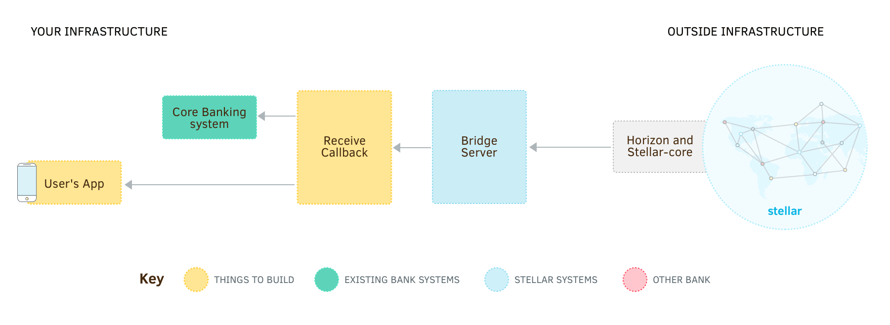

Stellar.org mantém um [servidor bridge](https://github.com/stellar/bridge-server/blob/master/readme_bridge.md), o que torna mais fácil de usar os servidores federation e compliance para enviar e receber pagamentos. Ao usar o servidor bridge, o código que precisa ser escrito é apenas um servidor privado para receber notificações de pagamento e responder a verificações regulatórias dos servidores bridge e compliance.


Ao usar o servidor bridge, pagamentos são enviados fazendo uma POST request HTTP a ele em vez de um servidor Horizon. Isso não muda muita coisa para transações simples, mas irá tornar os próximos passos de federation e compliance muito mais simples.


## Criar uma Base de Dados

O servidor bridge requer uma base dados MySQL ou PostgreSQL para rastrear e coordenar transações e informações de compliance. Crie uma base de dados vazia chamada `stellar_bridge` e um usuário para administrá-la. Não é preciso adicionar nenhuma tabela; o servidor bridge tem [um comando especial que faz isso por você](#iniciar-o-servidor).


## Baixar e Configurar o Servidor Bridge

Em seguida, [faça download do servidor bridge mais recente](https://github.com/stellar/bridge-server/releases) para sua plataforma. Instale o executável onde quiser. No mesmo diretório, crie um arquivo chamado `bridge.cfg`. Ele irá armazenar as configurações para o servidor bridge. Deverá ficar mais ou menos assim:

<code-example name="bridge.cfg">

```toml
port = 8006
horizon = "https://horizon-testnet.stellar.org"
network_passphrase = "Test SDF Network ; September 2015"
# Preencheremos isto após preparar um servidor compliance
compliance = ""

# Isto descreve os ativos (assets) que podem ser enviados e recebidos.
# Repetir esta seção para adicionar suporte a mais tipos de ativos.
[[assets]]
code="USD"
issuer="GAIUIQNMSXTTR4TGZETSQCGBTIF32G2L5P4AML4LFTMTHKM44UHIN6XQ"

[database]
type = "mysql"  # ou "postgres" se você criou uma base de dados postgres
url = "dbusuario:dbsenha@/stellar_bridge"

[accounts]
# A seed secreta para sua conta base, a partir da qual são feitos os pagamentos
base_seed = "SAV75E2NK7Q5JZZLBBBNUPCIAKABN64HNHMDLD62SZWM6EBJ4R7CUNTZ"
# O ID da conta que recebe pagamentos em nome de seus clientes. Neste
# caso, é o ID da conta que bate com a `base_seed` acima.
receiving_account_id = "GAIGZHHWK3REZQPLQX5DNUN4A32CSEONTU6CMDBO7GDWLPSXZDSYA4BU"
# Uma seed secreta que pode autorizar trustlines para ativos emitidos por você. Para mais,
# veja https://stellar.org/developers/guides/concepts/assets.html#controlar-detentores-de-um-ativo
# authorizing_seed = "SBILUHQVXKTLPYXHHBL4IQ7ISJ3AKDTI2ZC56VQ6C2BDMNF463EON65U"
# O ID da conta que emite os seus ativos
issuing_account_id = "GAIUIQNMSXTTR4TGZETSQCGBTIF32G2L5P4AML4LFTMTHKM44UHIN6XQ"

[callbacks]
# O servidor enviará POST requests a esta URL para notificar pagamentos
receive = "http://localhost:8005/receive"
```

</code-example>


## Iniciar o Servidor

Antes de iniciar o servidor pela primeira vez, as tabelas da sua base de dados devem ser criadas. Rodar o servidor bridge com o argumento `--migrate-db` garante que tudo estará pronto:

```bash
./bridge --migrate-db
```

Cada vez que você atualizar o servidor bridge para uma versão nova, você deve rodar este comando novamente. Ele irá atualizar sua base de dados caso algo precise ser alterado.

Agora que sua base de dados está completamente configurada, você pode iniciar o servidor bridge rodando:

```bash
./bridge
```


## Enviar um Pagamento

O servidor bridge recebe comandos na forma de requests HTTP, então podemos testar submeter um pagamento enviando um `POST` request a `/payments`. Tente enviar 1 USD à conta `GCFXHS4GXL6BVUCXBWXGTITROWLVYXQKQLF4YH5O5JT3YZXCYPAFBJZB`. (Lembre que a conta recipiente precisa confiar no ativo primeiro. Veja [emitir ativos](../issuing-assets.md) para mais detalhes.)

<code-example name="Enviar um Pagamento">

```bash
curl -X POST -d \
"amount=1&\
asset_code=USD&\
asset_issuer=GAIUIQNMSXTTR4TGZETSQCGBTIF32G2L5P4AML4LFTMTHKM44UHIN6XQ&\
destination=GCFXHS4GXL6BVUCXBWXGTITROWLVYXQKQLF4YH5O5JT3YZXCYPAFBJZB&\
source=SAV75E2NK7Q5JZZLBBBNUPCIAKABN64HNHMDLD62SZWM6EBJ4R7CUNTZ" \
http://localhost:8006/payment
```

```js
var request = require('request');

request.post({
  url: 'http://localhost:8001/payment',
  form: {
    amount: '1',
    asset_code: 'USD',
    asset_issuer: 'GAIUIQNMSXTTR4TGZETSQCGBTIF32G2L5P4AML4LFTMTHKM44UHIN6XQ',
    destination: 'GCFXHS4GXL6BVUCXBWXGTITROWLVYXQKQLF4YH5O5JT3YZXCYPAFBJZB',
    source: 'SAV75E2NK7Q5JZZLBBBNUPCIAKABN64HNHMDLD62SZWM6EBJ4R7CUNTZ'
  }
}, function(error, response, body) {
  if (error || response.statusCode !== 200) {
    console.error('ERRO!', error || body);
  }
  else {
    console.log('SUCCESSO!', body);
  }
});
```

```java
import org.apache.http.HttpEntity;
import org.apache.http.HttpResponse;
import org.apache.http.NameValuePair;
import org.apache.http.client.HttpClient;
import org.apache.http.client.methods.HttpPost;
import org.apache.http.impl.client.HttpClients;
import org.apache.http.message.BasicNameValuePair;
import org.apache.http.util.EntityUtils;

import java.util.ArrayList;
import java.util.List;

public class PaymentRequest() {
  public static void main(String [] args) {
    HttpPost paymentRequest = new HttpPost("http://localhost:8006/payment");

    List<NameValuePair> params = new ArrayList<NameValuePair>();
    params.add(new BasicNameValuePair("amount", "1"));
    params.add(new BasicNameValuePair("asset_code", "USD"));
    params.add(new BasicNameValuePair("asset_issuer", "GAIUIQNMSXTTR4TGZETSQCGBTIF32G2L5P4AML4LFTMTHKM44UHIN6XQ"));
    params.add(new BasicNameValuePair("destination", "GCFXHS4GXL6BVUCXBWXGTITROWLVYXQKQLF4YH5O5JT3YZXCYPAFBJZB"));
    params.add(new BasicNameValuePair("source", "SAV75E2NK7Q5JZZLBBBNUPCIAKABN64HNHMDLD62SZWM6EBJ4R7CUNTZ"));

    HttpResponse response = httpClient.execute(paymentRequest);
    HttpEntity entity = response.getEntity();
    if (entity != null) {
      String body =  EntityUtils.toString(entity);
      System.out.println(body);
    }
  }
}
```

</code-example>


## Criar um Servidor para Receber Pagamentos



No arquivo de configuração do servidor bridge, talvez você tenha reparado em uma URL callback chamada `receive`. Sempre que um pagamento for recebido, o servidor bridge irá enviar um `POST` request HTTP à URL que você especificou. A principal responsabilidade do endpoint `receive` é atualizar o saldo de seu cliente em resposta a receber um pagamento (já que o pagamento foi à sua conta no Stellar).

<code-example name="Implementar o Callback Receive">

```js
/**
 * Um pequeno servidor web Express.js para tratar pagamentos a partir do bridge server.
 */

var express = require('express');
var bodyParser = require('body-parser');

var app = express();
app.use(bodyParser.urlencoded({ extended: false }));

app.post('/receive', function (request, response) {
  var payment = request.body;

  // `receive` pode ser chamado múltiplas vezes para o mesmo pagamento, então verifique que
  // você ainda não tenha visto este payment ID.
  if (getPaymentByIdFromDb(payment.id)) {
    return response.status(200).end();
  }

  // Como temos uma conta Stellar que representa vários clientes, o
  // cliente para o qual se destina o pagamento deve estar no memo da transação.
  var customer = getAccountFromDb(payment.memo);

  // É preciso verificar o asset code e issuer para ter certeza de que é um ativo
  // para o qual você pode aceitar pagamentos nesta conta. Neste exemplo,
  // somente convertemos a quantia para USD e adicionamos a quantia equivalente ao
  // saldo do cliente. Você vai precisar implementar `convertToUsd()` por si mesmo.
  var dollarAmount = convertToUsd(
    payment.amount, payment.asset_code, payment.asset_issuer);
  addToBankAccountBalance(customer, dollarAmount);
  response.status(200).end();
  console.log(dollarAmount + ' USD adicionados à conta: ' + customer);
});

app.listen(8005, function () {
  console.log('Callbacks do servidor bridge rodando no port 8005!');
});
```

```java
import javax.ws.rs.POST;
import javax.ws.rs.Path;
import javax.ws.rs.Consumes;
import javax.ws.rs.FormParam;
import javax.ws.rs.core.MediaType;
import javax.ws.rs.core.Response;

/**
 * Um pequeno servidor web Jersey para tratar callbacks vindos de serviços Stellar
 */
@Path("/")
public class StellarCallbacks {

  @POST
  @Path("receive")
  @Consumes(MediaType.APPLICATION_FORM_URLENCODED)
  public Response receive(
    @FormParam("id") String id,
    @FormParam("amount") String amount,
    @FormParam("asset_code") String assetCode,
    @FormParam("asset_issuer") String assetIssuer,
    @FormParam("memo") String memo) {

    // `receive` pode ser chamado múltiplas vezes para o mesmo pagamento, então verifique que
    // você ainda não tenha visto este payment ID. (getPaymentByIdFromDb é
    // um método que você terá de implementar.)
    if (getPaymentByIdFromDb(id)) {
      return Response.ok().build();
    }

    // Como temos uma conta Stellar que representa vários clientes, o
    // cliente para o qual se destina o pagamento deve estar no memo da transação.
    // (getAccountFromDb é um método que você terá de implementar.)
    Customer customer = getAccountFromDb(memo);

    // É preciso verificar o asset code e issuer para ter certeza de que é um ativo
    // para o qual você pode aceitar pagamentos nesta conta. Neste exemplo,
    // somente convertemos a quantia para USD e adicionamos a quantia equivalente ao
    // saldo do cliente. Você vai precisar implementar `convertToUsd()` por si mesmo.
    Double dollarAmount = convertToUsd(amount, assetCode, assetIssuer);
    addToBankAccountBalance(customer, dollarAmount);
    return Response.ok().build();
    System.out.println(String.format(
      "Adicionar %s, USD à conta: %s",
      dollarAmount,
      customer));
  }

}
```

</code-example>

Para testar e ver se o seu callback receive funciona, vamos tentar enviar 1 USD a um cliente com o nome de conta `Amy` em seu banco. (Para rever como enviar pagamentos usando a API, veja o [passo 3 de “para começar”](../get-started/transactions.md).)

<code-example name="Testar o Callback Receive">

```js
var StellarSdk = require('stellar-sdk');
var server = new StellarSdk.Server('https://horizon-testnet.stellar.org');
var sourceKeys = StellarSdk.Keypair.fromSecret(
  'SCZANGBA5YHTNYVVV4C3U252E2B6P6F5T3U6MM63WBSBZATAQI3EBTQ4');
var destinationId = 'GAIGZHHWK3REZQPLQX5DNUN4A32CSEONTU6CMDBO7GDWLPSXZDSYA4BU';

server.loadAccount(sourceKeys.publicKey())
  .then(function(sourceAccount) {
    var transaction = new StellarSdk.TransactionBuilder(sourceAccount)
      .addOperation(StellarSdk.Operation.payment({
        destination: destinationId,
        asset: new StellarSdk.Asset(
          'USD', 'GAIUIQNMSXTTR4TGZETSQCGBTIF32G2L5P4AML4LFTMTHKM44UHIN6XQ'),
        amount: '1'
      }))
      // Use o memo para indicar o cliente ao qual se destina o pagamento.
      .addMemo(StellarSdk.Memo.text('Amy'))
      .build();
    transaction.sign(sourceKeys);
    return server.submitTransaction(transaction);
  })
  .then(function(result) {
    console.log('Successo! Resultados:', result);
  })
  .catch(function(error) {
    console.error('Algo deu errado!', error);
  });
```

```java
Server server = new Server("https://horizon-testnet.stellar.org");

KeyPair source = KeyPair.fromSecretSeed(
  "SCZANGBA5YHTNYVVV4C3U252E2B6P6F5T3U6MM63WBSBZATAQI3EBTQ4");
KeyPair destination = KeyPair.fromAccountId(
  "GAIGZHHWK3REZQPLQX5DNUN4A32CSEONTU6CMDBO7GDWLPSXZDSYA4BU");
Asset dollar = Asset.createNonNativeAsset("USD", KeyPair.fromAccountId(
    "GAIUIQNMSXTTR4TGZETSQCGBTIF32G2L5P4AML4LFTMTHKM44UHIN6XQ"));

AccountResponse sourceAccount = server.accounts().account(source);
Transaction transaction = new Transaction.Builder(sourceAccount)
  .addOperation(new PaymentOperation.Builder(destination, dollar, "1").build())
  // Use o memo para indicar o cliente ao qual se destina o pagamento.
  .addMemo(Memo.text("Amy"))
  .build();
transaction.sign(source);

try {
  SubmitTransactionResponse response = server.submitTransaction(transaction);
  System.out.println("Successo!");
  System.out.println(response);
} catch (Exception e) {
  System.out.println("Algo deu errado!");
  System.out.println(e.getMessage());
}
```

</code-example>

Depois de rodar o código acima, seu servidor callback deve ter logado informações sobre o pagamento.

<nav class="sequence-navigation">
  <a rel="prev" href="./">Anterior: Arquitetura</a>
  <a rel="next" href="3-federation-server.md">Próximo: Servidor Federation</a>
</nav>
