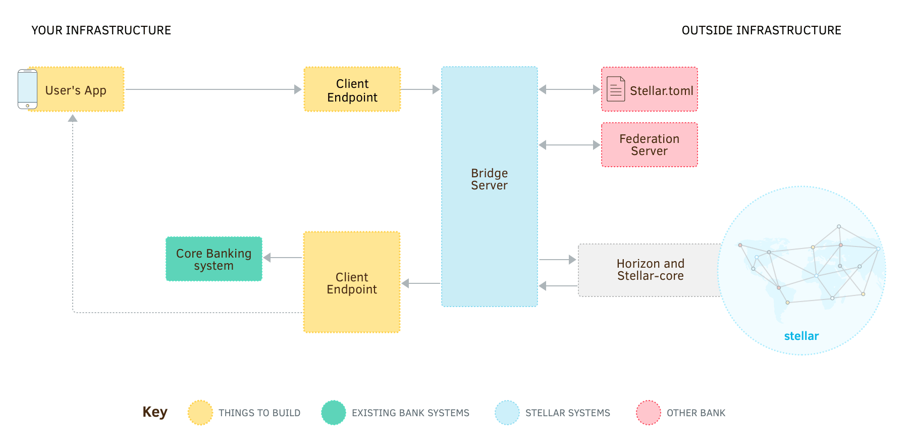

Ao testar o servidor bridge, adicionamos um `memo` à transação para identificar que conta de cliente deve ser creditada. Porém, outras pessoas e organizações que usem Stellar podem não saber que precisam fazer isso. Como elas podem descobrir?

O [protocolo Stellar federation](../concepts/federation.md) permite converter um endereço legível por humanos como `amy*sua_org.com`[^friendly_names] a um ID de conta. Ele também inclui informações sobre o que deve estar no `memo` da transação. Ao enviar um pagamento, contata-se um servidor federation primeiro para determinar a qual ID de conta Stellar pagar. Por sorte, o servidor bridge faz isso por você.



Stellar.org fornece um [servidor federation pré-construído](https://github.com/stellar/go/tree/master/services/federation) que pode se conectar a uma base de dados de usuário, mas você também pode escrever o seu próprio.


## Criar uma Base de Dados

O servidor federation Stellar é feito para conectar com qualquer base de dados SQL que você tiver que contenha uma lista de nomes de contas. Em essência, o servidor traduz uma request federation para um query SQL. O servidor dá suporte a MySQL, PostgreSQL, e SQLite3.

Sua base de dados deve ter, no mínimo, uma tabela com uma coluna que identifica o nome a ser usado para cada registro de conta.[^federation_tables] Em seu sistema, você pode ter uma tabela de nome `accounts` com mais ou menos essa cara:

| id | first_name | last_name | friendly_id         |
|----|------------|-----------|---------------------|
| 1  | Tunde      | Adebayo   | tunde_adebayo       |
| 2  | Amy        | Smith     | amy_smith           |
| 3  | Jack       | Brown     | jack_brown          |
| 4  | Steintór   | Jákupsson | steintor_jakupsson  |
| 5  | Sneha      | Kapoor    | sneha_kapoor        |

Onde o endereço Stellar de Tunde seria `tunde_adebayo*sua_org.com`.


## Baixar e Configurar o Servidor Federation

Em seguida, [faça download do servidor federation mais recente](https://github.com/stellar/go/releases) para sua plataforma. Instale o executável onde quiser. No mesmo diretório, crie um arquivo chamado `federation.cfg`. Ele irá armazenar as configurações do servidor. Deverá ter mais ou menos essa cara:

<code-example name="federation.cfg">

```toml
port = 8002

[database]
type = "mysql" # Ou "postgres" ou "sqlite3"
dsn = "dbusuario:dbsenha@/internal_accounts"

[queries]
federation = "SELECT 'GAIGZHHWK3REZQPLQX5DNUN4A32CSEONTU6CMDBO7GDWLPSXZDSYA4BU' as id, friendly_id as memo, 'text' as memo_type FROM accounts WHERE friendly_id = ? AND ? = 'sua_org.com'"
reverse-federation = "SELECT friendly_id, '' as domain FROM accounts WHERE ? = ''"

# O servidor federation deve estar disponível via HTTPS. Especifique seu
# certificado e chave SSL aqui. Se o servidor estiver detrás de um proxy ou load balancer
# que implementa HTTPS, você pode omitir esta seção.
[tls]
certificate-file = "server.crt"
private-key-file = "server.key"
```

</code-example>

Certifique-se de atualizar as informações de conexão à base de dados com os credenciais e nome adequados para sua base de dados. Também atualize o valor de `domain` no query `federation` para ser igual ao seu domínio atual em vez de `sua_org.com`.

O query `federation` é um query SQL que deve retornar as colunas `id`, `memo` e `memo_type` ao ser fornecido duas partes de um endereço Stellar como `tunde_adeboyo` e `sua_org.com` para o endereço `tunde_adebayo*sua_org.com`.

Como estamos mapeando todos os endereços a nossa conta base, sempre retornamos o ID da conta base para `id`. Assim como na primeira seção, queremos o `friendly_id` da conta como um memo de texto.

A query `reverse-federation` é obrigatória, mas como todas as contas de clientes são mapeadas a uma única conta Stellar em nosso design, precisamos ter certeza de que este query sempre retorna nenhuma linha.

Agora rode o servidor! (Diferentemente do servidor bridge, não há nenhuma base de dados personalizada para migrar.)

```bash
./federation
```


## Atualizar o Stellar.toml

Por fim, outros precisam saber o URL do seu servidor federation. O [arquivo `stellar.toml`](../concepts/stellar-toml.md) é um arquivo disponível ao público onde outros podem encontrar informações sobre sua integração Stellar. Ele deve sempre estar armazenado em:

`https://[SEU DOMÍNIO]/.well-known/stellar.toml`

Ele pode listar vários tipos de propriedades, mas o que nos importa agora é a URL do seu servidor federation. Seu arquivo `stellar.toml` deve ter mais ou menos essa cara:

<code-example name="stellar.toml">

```toml
FEDERATION_SERVER = "https://www.sua_org.com:8002/federation"
```

</code-example>

A URL real do seu servidor federation pode ser qualquer uma que quiser — pode estar no seu subdomínio `www` mas em um caminho diferente, pode estar em outro port, ou pode até estar em um domínio totalmente distinto. **Porém, ele deve estar disponível via HTTPS com um certificado SSL válido.**[^ssl]


## Enviar uma request Federation

Teste seu servidor federation enviando uma request HTTP:

<code-example name="Requisitar Informações Federation">

```bash
curl "https://www.sua_org.com:8002/federation?q=tunde_adebayo*sua_org.com&type=name"
```

```js
var request = require('request');

request.get({
  url: 'https://www.sua_org.com:8002/federation',
  qs: {
    q: 'tunde_adebayo*sua_org.com',
    type: 'name'
  }
}, function(error, response, body) {
  console.log(body);
});
```

```java
import org.apache.http.HttpEntity;
import org.apache.http.HttpResponse;
import org.apache.http.client.HttpClient;
import org.apache.http.client.methods.HttpGet;
import org.apache.http.impl.client.HttpClients;
import org.apache.http.util.EntityUtils;
import org.apache.http.client.utils.URIBuilder;
import java.net.URI;

class FederationRequest {
  public static void main(String [] args) throws Exception {
    URI federationUri = new URIBuilder("https://www.sua_org.com:8002/federation")
      .addParameter("q", "tunde_adebayo*sua_org.com")
      .addParameter("type", "name")
      .build();

    HttpGet federationRequest = new HttpGet(federationUri);
    HttpClient httpClient = HttpClients.createDefault();
    HttpResponse response = httpClient.execute(federationRequest);
    HttpEntity entity = response.getEntity();
    if (entity != null) {
      String body =  EntityUtils.toString(entity);
      System.out.println(body);
    }
  }
}
```

</code-example>

Você deve receber uma resposta do tipo:

```json
{
  "stellar_address": "tunde_adebayo*sua_org.com",
  "account_id": "GAIGZHHWK3REZQPLQX5DNUN4A32CSEONTU6CMDBO7GDWLPSXZDSYA4BU",
  "memo_type": "text",
  "memo": "tunde_adebayo"
}
```

<nav class="sequence-navigation">
  <a rel="prev" href="2-bridge-server.md">Anterior: Servidor Bridge</a>
  <a rel="next" href="4-compliance-server.md">Próximo: Servidor Compliance</a>
</nav>


[^friendly_names]: Endereços federados usam um `*` para separar o nome de usuário e o domínio para que os nomes de usuário possam ser endereços de e-mail, como `amy@gmail.com*sua_org.com`.

[^federation_tables]: Se você quiser que seu servidor federation cubra mais de um domínio, será preciso também uma coluna para armazenar os domínios.

[^ssl]: Exigir que serviços públicos estejam disponíveis via SSL ajuda a manter a segurança. Para testes, é possível pegar certificados gratuitos em http://letsencrypt.org. Você também pode gerar seus próprios certificados autoassinados, mas você precisa adicioná-los a todos os computadores em seus testes.
